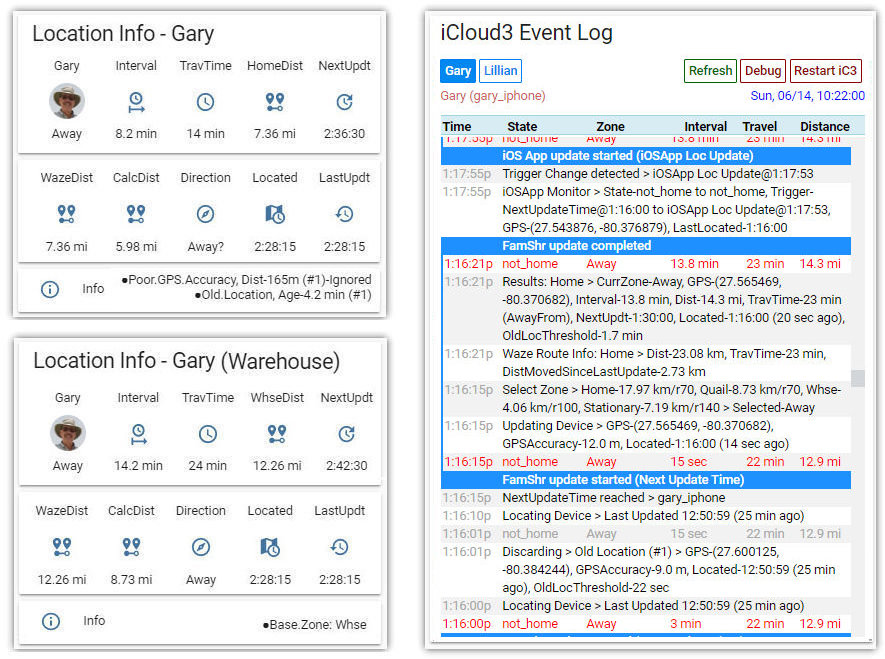

# Welcome to iCloud3 v2.3!

iCloud3 is a device_tracker custom_component for iPhones, iPads and iWatches. It is tightly integrated with the Home Assistant IOS App, uses the Waze Route Tracker for distance and time information, creates a Stationary Zone when you are stationary, lets you monitor distance and time information for the home zone and other zones (work, school, etc.), minimizes battery usage, and much more.

iCloud3 is a Home Assistant device tracker custom component that greatly expands the capabilities of the iCloud HA component. It exposes many new attributes, provides many new features, is based on enhanced route tracking methods, is much more accurate, and includes additional service calls

------

### Features

* Supports the Apple iCloud 2-factor-authentication Verification you are familiar with.
* Supports iCloud Location Services and the HA iOS App tracking methods. The most efficient method is automatically assigned to the devices you are tracking on a per device basis.
  * Family Sharing locates and tracks your family members that are in your iCloud Account's Family Sharing List.
  * Find-my-Friends locates and tracks the people who are sharing their location in the *FindMy App*.
  * Home Assistant iOS App is responsible for zone enter and exit notifications and location update triggers. It is also used if the others are not available, you do not want to use your iCloud account or there are problems with authentication or verifying trusted device access to your account.
* A variable polling interval that is based on the Waze Route Mapping Service (drive time and distance) rather than just a calculated straight line distance.
* Monitors the IOS App device_tracker and sensors to immediately capture zone enter, exit and location change notifications.
* Sensor templates are created that can be used in automations, in scripts and on Lovelace cards. The sensors that are created can be customized to suit your needs.
* Calculate distance and travel time for more than one zone.
* The iCloud3 Event Log Lovelace card lets you review tracking history, update transactions that have been discarded because of old locations or poor GPS, operational errors and the ability to restart iCloud3 without restarting Home Assistant.
* GPS wandering that randomly changes the device's state from home to not_home is eliminated.
* Short 15-second polling interval when you are less than 1 mi/km from home lets you reliably trigger automations based on an accurate distance.
* A Stationary Zone is created when you are in the same location for while (doctors office, mall, school, restaurant, etc.) to  reduce device polling and conserve battery life.
* Old location data and GPS inaccuracy locations are automatically discarded.
* Additional service call commands (setting intervals, pausing and resuming polling, zone assignment, etc.)
* No other tracking program (other than the HA iOS app) are needed to handle device tracking and presence detection. You will not need Nmap, OwnTracks, router based tracking components.
* New Configuration variables and Attributes let you customize how you want to use iCloud3.
* The iCloud3 configuration file (config_ic3.yaml) can be used for most of the configuration parameters. Change the iCloud3 parameters, restart iCloud3 on the iCloud3 Event Log card and they take effect immediately. Without restarting Home Assistant.
* Extensive documentation on how to use iCloud3, how to set it up and how to customize it to meet your needs. It includes many sample automations and scripts that you can use to set your own device tracking and presence detection.

And much more ...

### iCloud3 Information Card & Event Log Custom Card

*Gary Cobb, aka GeeksterGary*
