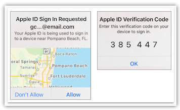
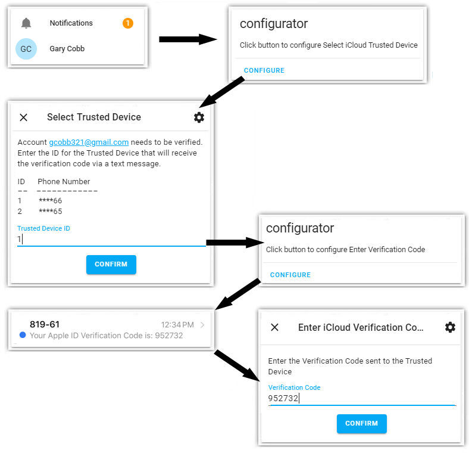

# Getting Started

This chapter explains:

- How to get ready to start using iCloud3.
- How iCloud3 works with your iCloud account and the iOS App.
- How to set up the iPhone's name to link iCloud3, iCloud Account and the iOS App together.
- General Information to help you select the iCloud3 tracking method.
- Authenticating your iCloud Account to allow access to iCloud Location Services.
- Why it's important to let iCloud3 request location information from your iCloud account and to install the iOS App on all the devices you are tracking.

  

### The iCloud Account and the iOS App

###### iCloud Account  

iCloud3 uses the iCloud Location Service to locate your device (iPhone, iPad, etc). (Go [here](https://www.icloud.com/) for more information). Two tracking methods are available, *Find-My-Friends* that uses the people you are sharing location information with in the in the FindMy app and *Family Sharing* that uses the list of family members in the Family Sharing List on your iCloud account. More about these later.

*Note:* The following documentation will refer to the iPhone (phoe) as the device being tracked although it could also refer to a iPad or iWatch.

###### Home Assistant Companion iOS App (iOS App)   

The iOS App keeps track of your zones, their location and size. When you enter or exit a zone, the iOS App issues a state change trigger and updates the device_tracker state of the entity associated with the iOS App. It also issues other location triggers that update the devices location in Home Assistant. iCloud3 monitors the iOS App device_tracker state for zone information and the last_update_trigger sensor for trigger/location changes every 5-seconds. More about this later.

!> The iOS App settings Zone enter/exit, Background Fetch and Significant Location Change location settings must be enabled. 

The HA proximity component also determines distance between zones and the iPhone, determines direction of travel, and other device_tracker related functions. Unfortunately, the iOS App can report old location information that is processed by the HA proximity component leading to GPS wandering and incorrect zone exits.

!> Do not use the proximity component when using iCloud3. iCloud3 duplicates the proximity functions and discards bad location information where the proximity component does not. 

!>You do not need OwnTracks or other location based trackers and you do not need Nmap, netgear, ping or other network monitors.

#### The phone's name creates the device_tracker entity name

The iPhone's (and iPad's) name in set in the phone's Settings App  `Settings App > General > About Name field`. Your iCloud account  does not store the Name field's value, it converts some special characters and spaces to underlines. For example, *Gary-iPhone* becomes *gary_iphone*. iCloud3 uses the iCloud Account name (*gary_iphone*) to identify the phones (or other devices) you want to track.

Tips on naming your phone or other devices:

1. Put your name first (*Gary-iPhone*) not last (*iPhone-Gary*). The iCloud3 sensors and the iCloud3 Stationary Zone name use this name as a prefix, e.g., (*gary_iphone_distance, gary_iphone_stationary, etc.*). The iCloud3 sensors are then all sorted together, the phone can be identified by the first 3 or 4-characters in the Event Log , etc. 
2. Use the device type (iPhone, iPad), not the phone's model (iPhone XS, iPad Air 3). This eliminates changing the phone's name in iCloud3, scripts and automation when you get a new phone.
3. Do not use apostrophes in the name; Use something like *Gary-iPhone*, not *Gary's-iPhone*. This eliminates the confustion when the name is converted, i.e., *Gary's iPhone* may be converted to *garys_iphone*, or *gary_s_iphone*, Another example: *Chris's iPhone* may be converted to *chriss_iphone* or *chris_s_iphone*.

### iCloud Account → iCloud3 ← iOS App

###### iCloud Account  

iCloud3 tracks iPhones using the iCloud Location Services. The name created from the `Settings > General > About > Name field` (*gary_iphone*) links the phone in the iCloud account to the phone being tracked by iCloud3. The iCloud3 track_devices configuration parameter uses the same name (*gary_iphone*) to identify the phone and to tie everything together. 

###### Home Assistant Companion iOS App (iOS App)   

When you install the Home Assistant Companion iOS App (iOS App) on the iPhone, the `Settings > General > About > Name field` is also used when the mobile_app integration device_tracker entity name is created (more info can be found on the `HA Sidebar > Configuration > Integration` screen).  The following describes steps you will need to take to prevent device_tracker entity name conflicts that may happen if the iOS App mobile_integration is set up before iCloud3 is installed.

- **iOS App is installed before iCloud3** - The iOS App creates an HA mobile_app integration device_tracker entity based on the phone's name on the `Setting > General > About` screen. It will probably use the same as used by the iCloud account (*gary_iphone*). Since the iCloud3 track_devices name must be the same as the iCloud account, this creates a conflict. A suffix must be added to the iOS App mobile_app integration device_tracker entity name to make it unique. Instructions are shown in the Setting Up the iOS App chapter..
-  **iOS App is installed after iCloud3** - Since the iCloud3 device_tracker entity name (*gary_iphone*) already exists, the iOS App will add a suffix to it's HA mobile_app integration device_tracker entity name ( *gary_iphone_2*).  This suffix prevents a conflict and nothing else needs to be done. You can rename the suffix to another value (*gary_iphone_app*) and iCloud3 will detect the new name when it starts.

The iCloud3 track_devices parameter specifies the names of the phones you want to track. An example is:

```
track_devices:
  - gary_iphone > gary567@email.com, gary.jpg
  - lillian_iphone > lillian987@email.com, lillian_jpg
```

!> ◆ The iCloud3 device name is the same as the iCloud iPhone's name (*device_tracker.gary_iphone = Gary iPhone*).<br>◆ The iOS App's device name is the iCloud3 name with a suffix (*device_tracker.gary_iphone_2*, *device_tracker.gary_iphone_app*, etc.)

When iCloud3 starts, it reads the HA Entity Registry file (*config/.storage/core.entity_registry*) and searches for a mobile_app device_tracker entity beginning with the device to be tracked (*gary_iphone*). If it finds the entity, the mobile_app device_tracker suffix is extracted and iCloud3 monitors that device_tracker entity (*device_tracker.gary_iphone_2*) for zone changes, trigger changes, etc. 

*> If the iOS App is deleted and then reinstalled, there may be several device_tracker entities for the same phone, each having a different suffix (*gary_iphone_2, gary_iphone_3, etc.). iCloud3 displays all the mobile_app device_tracker entities it finds for the phone and selects the last one. This can be overridden on the iCloud3 track_devices configuration parameter discussed later.

### iCloud3 Tracking Methods

iCloud3 can track your phones using three methods. You will need to decide which one makes the most sense for you based on your situation. Fortunately, It is easy to switch back and forth by changing only the iCloud3 *tracking_method* configuration parameter and restarting HA. The methods are:

###### Find-My-Friends (fmf)

The Find-my-Friends tracking method lets you track people you are sharing your location with on the FindMy App.

- Pros:
  - iCloud only locates the people on your ```FindMy App > People > Share My Location list``` so it is more efficient than the Family Sharing (famshr) tracking method.
  - You can track phones that are not associated with your iCloud account since anyone can be on the ```FindMy > People > Share My Location list```.
- Cons:
  - You have to add the people you want to follow to the FindMy App, send them an invitation and they have to accept the invitation.

###### Family Sharing (famshr)

The Family Sharing tracking method lets you track people on the Family Sharing list on your iCloud account.

- Pros:
  - Everyone on the Family Sharing list can be tracked.
  - iCloud locates all the devices on the Family Sharing list at the same time.
  - Easier to set up since you do not have to send out invitations. You only specify the names of the devices in the Family List that you want to track.
- Cons:
  - All devices on your Family Sharing list are located whether-or-not they are tracked by iCloud3. it can be less efficient than the Find_my_Friends tracking method if you have a lot of devices on the list.

*Example*: My Family Sharing list contains my iPhone, my wife's iPhone, my iPad, my wife's iPad, an old iPad Mini and my mother's iPad. I am only tracking my iPhone and my wife's iPhone so I use the Find-my-Friends tracking method.

The Apple support web site has several articles that will help you set up your iCloud account to prepare it for using iCloud3.

- Go [here](https://support.apple.com/en-us/HT210400) for *Set up Find My app*
- Go [here](https://support.apple.com/en-us/HT201493) for *Set up and use Find My Friends*
- Go [here](https://support.apple.com/en-us/HT201088) for *Set up Family Sharing*

###### iOS App (iosapp)

The iOS App tracking method lets you track your phones without interacting with iCloud Location Services. Location requests are sent to the iOS App on the phone using the push notification method built into Home Assistant,

- Pros:
  - It can be used when you do not want to access your iCloud account from HA.
  - It can be used when iCloud is down.
  - It can be used when you are having problems authenticating iCloud3 access to your iCloud account because of 2fa verification issues or the *Trusted Device Certificate* keeps expiring.
- Cons:
  - When the iPhone goes to sleep, the iOS App may (will) not respond to location requests, even after it wakes up and you start using it. You will need to launch the iOS App, which will then issue a *Launch trigger* to iCloud3 with location information. iOS will then begin running the iOS App in the background.

Information about the iOS App (Home Assistant Companion) can be found [here](https://companion.home-assistant.io/).


### Authenticating Your iCloud Account

Home Assistant and iCloud3 needs to be authenticated to access your iCloud account. It requests authentication by asking iCloud to send a verification code via a text message to a trusted device, which is then entered in Home Assistant. The duration of this authentication is determined by Apple, but usually several months.  

!>This will all happen after you configure iCloud3 and restart HA for the first time. 

When your account needs to be authenticated for the first time or reauthenticated every several months, the screen below maybe displayed on your phone or other device using the iOS App:



> Touch **Allow** and **OK** to close these popup windows. 
>
> <u>**You will not do anything with the Apple ID Verification Code shown on this screen. It can be ignored.**</u> 

The code displayed on these popup windows is used for authenticating an app you downloaded from the Apple App Store. iCloud3 (and Home Assistant) are not apps, they are programs and the method to authenticate a program is different. 

#### How to Authenticate your iCloud Account  {docsify-ignore}

When a the device needs to be authenticated, a dot is displayed next to the Notifications on the Home Assistant sidebar in the lower left. Do the following to complete the authorization process:  

1. Select **Notifications** on your Home Assistant screen to open the Notification window. 
1. Select **Configure**. A window is displayed that lists the trusted devices associated with your account. It will list an number (1, 2, etc.) next to the phone number that you will receive the text message with the 6-digit verification code.
1. Type the **ID** (1, 2, etc) number for the device. Then select **Confirm**. A text message is sent to the device with the 6-digit verification code you will enter is Step 5 below.
1. Select **Configure** again in the HA Notifications window again to open the Enter Verification Code window.
1. Type the **6-digit verification** code you received on the trusted device you selected in step 2. Then select **Confirm**.

Every 2-months or so, you will need to reauthenticate access to your iCloud account using these procedures. A message is displayed in the Event Log and several other places when this happens. The following shows the windows that will be opened:



#### How to Force an Immediate Authentication Request  {docsify-ignore}

You may run into a problem where the authentication is never requested, there is an error during the authentication process or you want to reset access to your iCloud Account. Follow the steps below:

1. A cookie file is created when you start iCloud3 and it tries to authenticate access to your iCloud Account the first time. The file is in the *config/.storage/icloud* directory on the computer running Home Assistant. It's name is the iCloud3 username parameter, the email address you use to log into your iCloud Account without any punctuation (*garyicloud993emailcom*).
2. Rename the cookie file.
3. Restart Home Assistant. The file will be recreated and you should see the HA Notification alert.


### Impact of not using iCloud Location Service or the iOS App

#### What happens if I don't want to use my iCloud Account  {docsify-ignore}

If you don't want to use the iCloud Location Service to locate your device, you will not experience the full benefit of iCloud3. Your tracking will be limited to monitoring changes to the iOS App device_tracker entity and the iOS App last_update_trigger for location updates and state changes. iCloud3 will update the tracked devices states relating to when a zone is entered into or exited from, when you do a manual location update and when there are other significant location updates generated by the iOS App. 

> The iOS App (*iosapp*) tracking_method is used if you do not want to use the information provided by iCloud Location Services.

###### When the iCloud Location Service is down   

There will be times when the iCloud Location Service is not used or is disabled. Reasons include the Apple iCloud service is down, the iCloud account can not be found, the iCloud account name and password are not correct, there is an error authenticating and verifying the iCloud account, etc. In these cases, iCloud3 will use the *iosapp* tracking method and try to reconnect every 15-minutes.

The following occurs:

- iCloud3 will rely on iOS app to provide Zone enter/exits, Background Fetch, Significant Location Update and Manual triggers to know where the phone is located.
- iCloud3 will not poll the phone on a regular basis since it can't access the iCloud Location Service. The decreasing interval as you approach Home or another zone will be not be done. Automations and scripts based on a short distance from home will not trigger. Automations and scripts triggered on a zone change should continue to work.
- The phone is not located when HA starts by the iOS App. It may take a few minutes to process the next iOS app notification to locate the phone.

#### What happens if I don't want to use the iOS App  {docsify-ignore}

iCloud3 monitors changes to the iOS App device_tracker entity and the iOS App last_update_trigger for location updates and state changes that indicate if you have entered into or exited from a zone. If you do not use the iOS App, you will not receive location updates and zone changes on a timely basis. iCloud3 will enter into or exit from a zone the next time it gets location information from iCloud Location Services, based on the polling interval, which may be 2-hours or more after the event occurred.

!> iCloud3 can not enter and exit zones when it happens If the iOS App is not installed on the phone.
