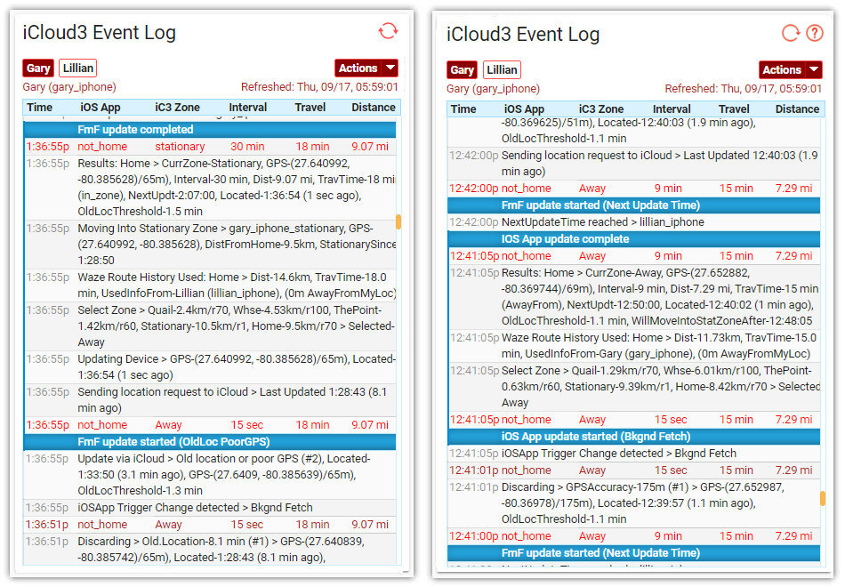

# Installing the iCloud3 Event Log Card

This chapter explains:

- About the iCloud3 Event Log 
- Installing the Event Log
- Using the Event Log to solve set up problems
- Examples of the Event Log screens

### About the Event Log

As iCloud3 runs, various entries are written to the iCloud3 Event Log that show:

- Device information
- How the device is tracked
- Operational errors
- Startup information
- Waze route information
- Tracking metrics

This information can help you troubleshoot operational errors, monitor tracking results, etc.

Below are some examples of the Event Log. 

##### Event Log during iCloud Initialization


##### Event Log locating devices


 

### Do not Record iCloud3 Events in the HA History Database

The *sensor.icloud3_event_log* entity is used to pass events from iCloud3 to the Event Log. The size of the text in this sensor can become very large after you have been running HA for a while. There is no need to record this entity in the HA database every time it changes. To prevent this, add the following to your configuration.yaml file:

```
recorder:
  purge_keep_days: 3
  exclude:
    entities:
      - sensor.icloud3_event_log
```

More information on configuration the *recorder* can be found in the HA documentation [here](https://www.home-assistant.io/integrations/recorder/).

Below is an example of the error that may occur if you do not exclude the *sensor.icloud3_event_log*.

```
2020-10-31 16:11:11 ERROR (Recorder) [homeassistant.components.recorder] Error executing query: (MySQLdb._exceptions.DataError) (1406, "Data too long for column 'attributes' at row 1")
[SQL: INSERT INTO states (domain, entity_id, state, attributes, event_id, last_changed, last_updated, created, old_state_id) VALUES (%s, %s, %s, %s, %s, %s, %s, %s, %s)]
[parameters: ('sensor', 'sensor.icloud3_event_log', ...', 13414815, datetime.datetime(2020, 10, 31, 15, 1, 10, 494582, tzinfo=datetime.timezone.utc), datetime.datetime(2020, 10, 31, 15, 1, 10, 494582, tzinfo=datetime.timezone.utc), datetime.datetime(2020, 10, 31, 15, 1, 10, 494716, tzinfo=datetime.timezone.utc), 12914612)]
(Background on this error at: http://sqlalche.me/e/13/9h9h)
Traceback (most recent call last):
  File "/usr/local/lib/python3.8/site-packages/sqlalchemy/engine/base.py", line 1276, in _execute_context
    self.dialect.do_execute(
  File "/usr/local/lib/python3.8/site-packages/sqlalchemy/engine/default.py", line 593, in do_execute
    cursor.execute(statement, parameters)
  File "/usr/local/lib/python3.8/site-packages/MySQLdb/cursors.py", line 206, in execute
    res = self._query(query)
  File "/usr/local/lib/python3.8/site-packages/MySQLdb/cursors.py", line 319, in _query
    db.query(q)
  File "/usr/local/lib/python3.8/site-packages/MySQLdb/connections.py", line 259, in query
    _mysql.connection.query(self, query)
MySQLdb._exceptions.DataError: (1406, "Data too long for column 'attributes' at row 1")
```


### Installing the Event Log

Typically Lovelace custom cards are stored in their own directory that is within the `config/www/` directory. iCloud3 and the instructions below, use the `www/custom_cards` directory although you may be storing them in another location (e.g.,`www/community`). 

!>If you are not using the `www/custom_cards` directory, use your directory name (e.g., `www/community`) instead of `www/custom_cards` in the following instructions. Then, use the iCloud3 *event_log_card_directory: www/yourcustomcarddirectoryname* configuration parameter to specify your directory name.

The Event Log must be setup in Lovelace before it can be used. This can be done using the HA Configurator or by specifying the Lovelace parameters in the *configuration.yaml* and *ui-lovelace.yaml* files for Lovelace yaml mode. Below describe each method.

#### Configurator Mode - Setting up the Lovelace Resource

The Lovelace Resource specifies where you are storing the iCloud3 Event Log custom card. Select ** or ** based on the method you use to create and maintain Lovelace cards.

Do the following:

1. Select **HA Sidebar > Configuration > Lovelace Dashboard**s. Select **Resources** at the top of the screen.
2. Click the **Add button** ('**+**') in the lower-left.
3. Enter the iCloud3 Event Log custom card file location in the url field in the following window:   
	
4. Select **Create**.

#### Configurator Mode - Setting up the Lovelace Dashboard Card

Do the following:

1. Select  **HA Sidebar > YourDashboard** where *YourDashboard* is the Lovelace card you want to add the Event Log card to.

2. Select the 3-dots in the upper-right corner (Open Lovelace UI Menu). Then select **Configure UI**.

3. Continue with the *Using the Raw Configuration Editor* or *Using the Lovelace Configuration Windows* below.

##### Using the Raw Configuration Editor

4. Select the **3-dots** in the upper right-hand corner of the screen to open the Selection Window, 
5. Select **Raw Configuration Editor**. The actual yaml code controlling the Lovelace dashboards, views and cards is displayed. 
6. Add the iCloud3 Event Log Card code below starting at the end of the file, then Select **Save**.


	badges: []
	  cards:
	    - type: 'custom:icloud3-event-log-card'
	      icon: 'mdi:information-outline'
	      path: icoud3-event-log
	      title: iCoud3 Event Log

##### Using the Lovelace Configuration Windows

4. Select the **Plus Sign (+)** sign to add a new view to the View Configuration window.
   
5. Fill in the **Title** and **Icon** fields. Select **Save**. The example below uses iC3EvLog for the title but you can use what ever you want. The icon, if specified, will be displayed on the dashboard.
   
6. Select the **Plus Sign (+)** (Add Card) on the right side of the window to select the custom card to be added.
   
7. Scroll to the bottom of the list and select *Manual* to display the add Card Configuration window.
   
8. Type **custom:icloud3-event-log-card** in the *Type* field. Then Select **Save**.
   
9. The iCloud3 Event Log will be displayed. Then Select **Save** to update your lovelace configuration..
   

More information is found in the Home Assistant Lovelace documentation regarding setting up and using custom cards. Be sure to refer to it if you have any problems. Go [here](https://community.home-assistant.io/t/how-do-i-add-custom-cards-with-the-lovelace-ui/97902) for more information if you are not using the `ui-lovelace.yaml` file to set up your cards.

#### yaml Mode - Setting up the Lovelace Resource

Open the `configuration.yaml` file and add the following lines to the lovelace resources parameter. Again, change the directory name if you are using a different location.

>Example using *'www/custom_cards'*
>
>```
>lovelace:
>mode: yaml
>resources:
>- url: /local/custom_cards/icloud3-event-log-card.js
> type: module
>```

>Example using *'www/community'*
>
>```
>lovelace:
>mode: yaml
>resources:
>- url: /local/community/icloud3-event-log-card.js
> type: module
>```

#### yaml Mode - Setting up the Lovelace Dashboard Card

Add the following lines to the Lovelace Dashboard/Card in the *ui-lovelace.yaml* file that will display the Event Log.
```
    - title: iCloud Event Log
      icon: mdi:information-outline 
      cards: 
        - type: custom:icloud3-event-log-card
          entity: sensor.icloud3_event_log
```

