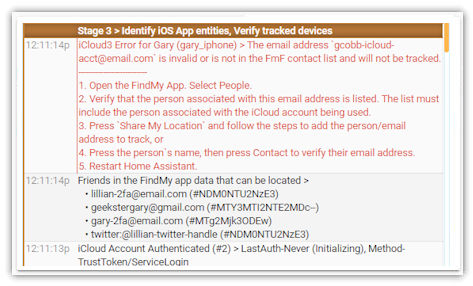

# Preparing for iCloud3

This chapter explains how to:

- Decide what tracking method you want to use.
- Set up iCloud account for the Find-My-Friends tracking method using the iPhone's FindMy App or for the Family Sharing tracking method using the iPhone's Settings App.

### iCloud3 Tracking Methods

The previous chapter described the tracking methods you can use.

- **Family Sharing (famshr)** - The people you want to track are on your Family Sharing list on your iCloud account, along with other Apple devices you don't want to track. Remember, when you use this tracking method, iCloud will locate all of the devices whether you are tracking them or not.
- **Find-My-Friends (fmf)** - Uses the people that you are sharing your location with on the FindMy App. This is probably most efficient method to use in regards of how iCloud locates devices and lets you  track people that are not on your Family Sharing List.
- **iOS App (iosapp)** - This tracking method does not interact with the iCloud account to located the phones and relies only on the iOS App for zone enter/exit and location data. iCloud3 will react to the phone's device_tracker state entity and monitor location changes triggered by various events. It can be used to track the phone when there are problems authenticating and verifying the iCloud account and HA server due to 2fa security issues.

### Family Sharing Tracking Method and the Settings App

The Family Sharing list is part of your iCloud account and set up on the Settings App.

1. Open the *Settings*.
2. Select  **Your Profile (Apple ID, iCloud, iTunes & App Store)****. 
3. This will open *Your Apple Profile* screen. 
4. Select **Family Sharing** to open the *Family Sharing* screen.
5. Select **Add Family Member** to open the *Invite via iMessage* popup window.
6. Select **Invite via iMessage**. They be added to the Family Sharing List after they accept the invitation. Verify that Location Sharing is turned on on their iPhone.


> Go to Apple the support web site [here](https://support.apple.com/en-us/HT201088) for more information on setting up  and using Family Sharing.

### Find-My-Friends Tracking Method and the The FindMy app

The Find-my-Friends (FmF) tracking method locates the people you have set up on iPhone's ```FindMy App > People``` screen. When they are added, their iCloud account email address adds the phone to the *Share Location* list and is used on the iCloud3 track_devices parameter. 

The person's email address ties the phone being tracked on the iCloud3 track_devices parameter (*gary_iphone*)  to the person on the Share My Location list (*gary-icloud-acct@email.com*).

1. Open the FindMy App.
2. Select **People**. Then select **+ Share My Location**.
3. This will open the *Share My Location* popup window. Select the person to add to the list using their mobile phone number or their email address.
4. Select **Send** to send a sharing invitation to that person. 
5. Open the email requesting approval and the **Accept the invitation**. 
6. Verify that Location Sharing is on turned on their iPhone.


> Go to Apple the support web site [here](https://support.apple.com/en-us/HT210400) for more information on the FindMy App and go [here](https://support.apple.com/en-us/HT201493) for more information on setting up and using Find My Friends.

#### Problems with tracking only yourself or tracking only one phone with Find-my-Friends

##### The FindMy app does not let you track yourself

- On the FindMy App > People window, you select the *+ Share My Location* in the FindMy App on your phone and enter your own email address (the one you used in the iCloud3 username/password configuration parameters), an error screen is displayed telling you that "You cannot share with yourself." 
- On the FindMy App > Me window, you select the "Use this device to track me". Unfortunately, iCloud Web Services does not provide the necessary linkage between the device and a person (you) that is used by iCloud3. iCloud3 analyzes the FindMy data when starting -- it searches through the people you are following and the people that are following you for the linkage information. Since you can not follow yourself, you are not in either list and the following error is displayed in the Event Log.



##### Solution - Create a second iCloud account

The only solution to this problem is to create another iCloud account and use that account in the username/password iCloud3 parameter. Generally, you will do the following. See *Setting up a new iCloud Account (an iCloud Tracking Account)* below for detailed information.

1. Create another iCloud Account with an email address different that your "real" email address. You can use another email address you may have or create one specifically for the Find-my-Friends tracking method.
2. Log into that account on your iPhone, iPad, Mac or PC. 
3. Add the 'friends', the people that use the devices you want to track, in the `Contacts` app when you are signed into this new account. You only need to enter their name and the email address of their actual iCloud account. 
4. Open the FindMy App and select *"+ Share My Location* for each phone you want to track, including yourself with your real email address tied to your real iCloud account.
5. Sign out of this other account. If you are on your iPhone or iPad, select *No* when asked if you want to merge the contacts, keychain or other items with iCloud. 
6. Sign back into your real iCloud account.
7. On each of the devices you are tracking, accept the sharing invitation.
8. Change the iCloud3 username/password parameters to your second account, the one you just created in step 1.
9. The iCloud3 track_devices parameter should still have your email address and the email addresses of the people you are following.
10. Restart HA and iCloud3. You should now be tracking yourself.

#### Setting up a new iCloud Account (an "iCloud Tracking Account")

Follow these procedures to be able to track yourself and others using the Find-my-Friends tracking method.

#### Create a new iCloud Tracking Account

1. Go to https://appleid.apple.com.
2. Click **Create Your Apple Id** at the top of the screen.
3. Fill in the identification information requested.
4. Fill in your name, birthday, email you will are creating, password, etc.
5. Fill in the Phone number and go through the account verification process.

#### Setting up your new iCloud Tracking Account

The following steps are easier if you do this at *icloud.com* on a PC or Mac rather than on your iPhone or iPad signed into your "real" iCloud account. If you do do this on your iPhone or iPad, sign out of your iCloud account on the Settings App.

2. Go to icloud.com or sign out of your "real" iCloud account on your iPhone or iPad. Then signin into your new iCloud Tracking Account you just created. Agree to the Terms & Conditions.
2. Select *Contacts* at icloud.com or open the Contacts App. Add the 'friends', the people that use the devices you want to track. You only need to enter their name and the email address of their actual iCloud account. 
3. Select *Find Friends* at icloud.com or open the FindMy App. Follow the procedures in the *Find-My-Friends Tracking Method and the The FindMy app* above to Share your Location by sending them an invitation using their contact name/email address add in step 2. Do this for everyone you want to track.

!> Verify that the Find My app and your iCloud Tracking Account at *icloud.com* can locate the people you are tracking. They should be displayed on the map in the *FindMy app* when signed into the new iCloud Tracking Account and the 'Sharing With ...'  message should be displayed in the app when you are signed into the new iCloud account. 

!> **If the devices can not be seen in the app, they will not be located by iCloud3.**

Now that you have verified that everything is set up correctly, sign out of the new iCloud Tracking Account and sign back into your real iCloud account. You will only need to sign back into the iCloud Tracking Account if you want to track another device.

Use this iCloud Tracking Account in the iCloud3 username/password configuration parameters.


*Overview of how iCloud3 uses the people's contact information to link the iCloud location to the tracked device*

### iOS App Tracking Method

To use this tracking method, you must install the iOS App on each phone you are tracking and associate the device_tracker entity names with the track_devices configuration parameter. This is described in detail in chapter *1.4 Setting up the iOS App*.