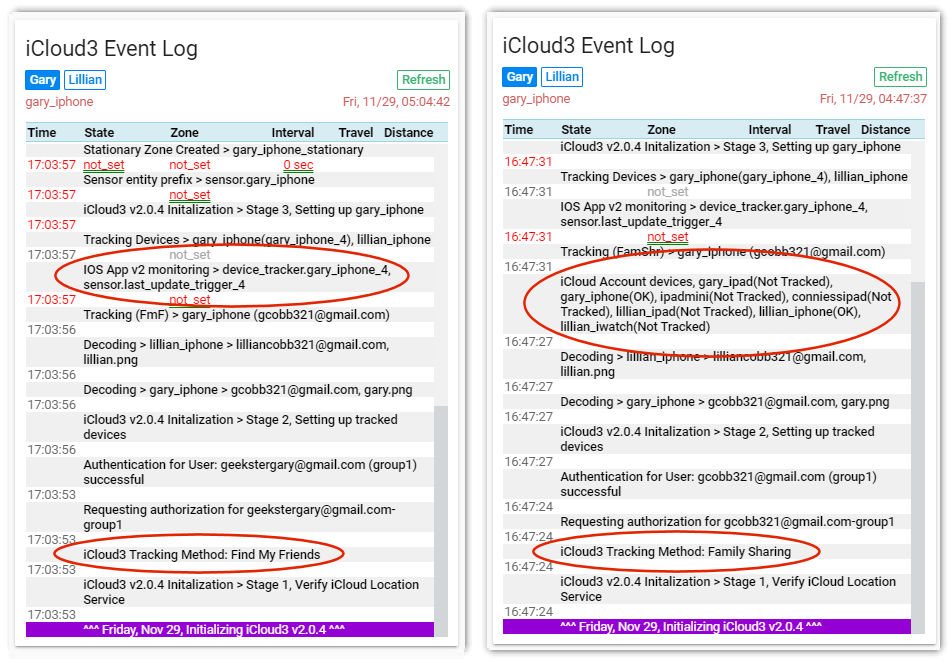
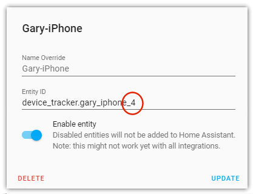
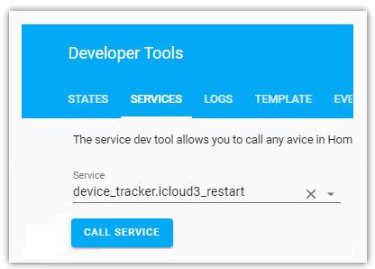

# Setting up your iCloud Account

### What other programs do I need
The `Home Assistant IOS App` is all. You do not need OwnTracks or other location based trackers and you do not need Nmap, netgear, ping or any network monitor. The Home Assistant IOS App will notify Home Assistant when you leave Home or another zone and iCloud3 device tracker will start keeping up with the device's location, the distance to the zones and the time it will take to get each one.

!> The IOS App settings `Zone enter/exit, Background Fetch and Significant Location Change` location settings need to be enabled. 

The iCloud3 platform allows you to detect presence using the iCloud Location Service. (Go [here](https://www.icloud.com/) for more information). Your device is tracked based on it’s primary user and needs to be registered with Find-my-Friends (iOS 12 and icloud.com), the Find My app (iOS 13), or be included as a family member in the Family Sharing list on your iCloud account.

The HA proximity component also determines distance between zones and the device, determines direction of travel, and other device_tracker related functions. Unfortunately, the HA iOS App can report old location information that is processed then by the proximity component leading to GPS wandering and incorrect zone exits.
​		
!> It is highly recommended to not use the proximity component when using iCloud3. iCloud3 duplicates the proximity functions and discards bad location information where the proximity component does not.

### What if I don't have the HA IOS App on my device
The Home Assistant IOS App issues zone enter/exits and pushes location updates to HA and thus iCloud3. If you only do not use the HA IOS App and only use the Find-my-Friends and Family Sharing tracking methods that are tied to your iCloud account, you will receive location updates and other device information when the tracked device is polled by iCloud3, i.e., iCloud3 asks for it. If the IOS App is not installed on the device, the zone enter/exits will not be picked up when they actually happen.

The device will be updated on the next poll by iCloud3. If, for example, you are exit a zone and are on a 2-hour polling interval, it could be 2-hours before the device goes to a not_home (away) state. With the HA IOS App, the zone exit is pushed to HA immediately, gets picked up by iCloud3 and the device's state is changed. This happens within 10-seconds of getting the exit notification for the zone. Naturally, if you are in a poor service area, this notification may be delayed.

###  iCloud and 2-Factor Authentication
When you set up an Apple iCloud account, '2-step authentication or 2-factor authentication (2fa)' is normally turned on account. This has an enormous impact on how your iCloud account is accessed. 

#### 2fa is turned on {docsify-ignore}
In order retrieve location information, iCloud3 must establish a computer-to-computer link with the Apple iCloud account and it has to be authenticated every time the account is accessed. Unfortunately, the HA computer can not be set up as a 'Trusted Device', so every 30-minutes, or so, Apple logs the HA computer, and thus iCloud3, out of the account. The result is HA and iCloud3 must log back into the account when it wants new location information. 

Every time you log into your Apple iCloud account, Apple sends a notification to all of your trusted devices informing you that your account has been logged into for your approval (a map is displayed with an Allow/Don't Allow message), followed by a second notification containing a 6-digit code that you can not do anything with.  

This gets annoying and makes working with iCloud accounts with 2fa unworkable.

#### 2fa is not turned on {docsify-ignore}
None of the above happens.

### Locating Your Device with iCloud
iCloud Location Services provides 2 methods for locating your iPhone or other device. iCloud3 supports both methods and the one you use will depend on if you are using 2-factor authentication with your Apple iCloud account.

#### Apple iCloud Documentation
The Apple support web site has several articles that will help you set up yout iCloud account to prepare it for using iCloud3.
- Go [here](https://support.apple.com/en-us/HT201493) for Set up and use Find My Friends 
- Go [here](https://support.apple.com/en-us/HT201088) for Set up Family Sharing
- Go [here](https://support.apple.com/en-us/HT210400) for Set up Find My app

#### Find-my-Friends (FmF) tracking method
You set up the device’s primary user as a friend on the `Find My` app (iOS 13) or the `Find-my-Friends` app (iOS 12) and iCloud3 will locate them just like the app does. Since your Apple iCloud account probably has 2fa turned on, you need to create a new iCloud account without 2fa, then add the person using the device as a friend to that account, share their location and verify their location is being shared before setting up iCloud3.

1. Add a new iCloud account with a different email address. Do not select the 2fa option, otherwise you will be in the same constant notification situation you are trying to avoid. You will use this email address in the `username` configuration parameter.

!> This is easier to set up if you do it on a device you will not be locating. 

!> IOS 13 turns on 2fa automatically and it can not be turned off. The non-2fa account should be added on a computer instead of an iPhone or iPad.

2. Add the 'friends', the people that use the devices you want to track, in the `Contacts` app when you are logged into this new account. You only need to enter their name and the email address of their actual iCloud account.

3. Add them to the `Find My` app (iOS 13) or the `Find-my-Friends` (iOS 12) app. You will need to send friend requests and then confirm them on each device so you will need to have access to their devices. 

4. Verify that the `Find My` or the `Find-my-Friends` app and your iCloud account at icloud.com can locate your 'friends' before continuing to set up iCloud3. They should be displayed on the map in the app when logged into the new non-2fa account and the 'Sharing With ...'  message should be displayed in the app when logged into the actual account.

!> If the devices can not be seen in the app, they will not be located by iCloud3.

*This diagram shows how the Find-my-Friends Contact List information is stored on your iCloud Account. iCloud3 accesses this information to locate your devices. If any of the information is missing or not set up correctly, iCloud3 can not locate your device.* 

#### Trouble Shooting the Find-my-Friends (FmF) tracking method {docsify-ignore}   

#####  iCloud3 Error: No devices to track message

This can be caused by the following conditions:

1. The contacts have not been added to the*Find-my-Friends* non-2fa account with the email address you have entered on the track_devices parameter. See item 4 above and verify they are visible on the `Find My` app.
2. The *Find-my-Friends* non-2fa account username or password is invalid and the account can not be authorized. Verify that the account can be accessed in the `Find My` app. If you need additional help, the links in the Apple iCloud Documentation paragraph above are a good source of information.
3. You can not connect to the iCloud Location Services. Again, check the *Find-my-Friends* non-2fa account username and password. Check for network errors. 

#### Family Sharing (FamShr) Tracking Method

If you do not have 2fa turned on on your 'real' iCloud account, you can use the Family Sharing tracking method to locate your device(s). iCloud3 looks for the devices to be tracked in the list of people that are in the Family Sharing list on your iCloud account. With Family Sharing, you use your 'real' iCloud account email address for the `username`  configuration parameter.

The `tracking_method` and `track_devices` configuration parameters are used to indicate how tracking should be done and the devices to be tracked.

!> Family Sharing was the only tracking method used on iCloud3 version 1.

#### Trouble Shooting the Family Sharing (FamShr) Tracking Method {docsify-ignore}   

##### You get an iCloud3 Error: No devices to track message

iCloud3 scans through the list of devices that have been set up in the Family Sharing part of your iCloud account. If it can not match the devicename with one in the account, that device will not be tracked. 

1. A message is added to the HA log file and the iCloud3 Event Log with all of the devicenames in the iCloud account, if a matching entry is found and the device will be tracked or if no matching entry is found and the device will not be tracked. Verify the devicename matches the name of the device in the' Settings App>General>About' for the device you want to track but is not. See the the 'Associating the iPhone Device Name with Home Assistant using the Home Assistant IOS App' below for information about naming your phone.
2. The username or password is invalid and the account can not be authorized. Verify the account can be accessed in the `Find My` app. If you need additional help, the links in the Apple iCloud Documentation paragraph above are a good source of information.
3. You can not connect to iCloud Location Services. Check the username and password. Check for network errors. 

#### iCloud3 Event Log During Initialization

The Event Log provides a lot of information on the iCloud initialization process.

### Authenticating Your iCloud Account
Home Assistant and iCloud3 needs to be authorized to access your iCloud account. It requests authorization by asking iCloud to send an authentication code via a text message to a trusted device, which is then entered in Home Assistant. The duration of this authentication is determined by Apple, but is now at 2 months.  

When your account needs to be authorized, or reauthorized, the request will be displayed in the Notifications section on the Home Assistant sidebar in the lower left. Do the following to complete the authorization process:  

1. Press the Notifications on your Home Assistant screen to open the Notification window. A window is displayed, listing the trusted devices associated with your account. It will list an number (0, 1, 2, etc.) next to the phone number that can receive the text message containing the 2-step authentication code number that is used to authenticate the computer running Home Assistant (your Raspberry Pi for example).
1. Type the number for the device. A text message is sent to the device with the 6-digit code.
1. Type the 6-digit authentication code you receive in the next window that is displayed.

### Associating the iPhone Device Name with Home Assistant using the Home Assistant IOS App
The name in `Settings App>General>About>Name` field on the iPhone and iPad and in the Apple Watch App for the iWatch is stored in the iCloud account and used by Home Assistant to identify the device. HA converts any special characters found to an underscore, e.g., `Gary-iPhone` becomes `gary_iphone` in HA (entity registry and `known_devices.yaml`) which is then used in automations, sensors, scripts, etc. The way this ties to the iCloud3 tracked_device depends on the version of the HA IOS App you are using on the device.

!> TIP: Device names should be simple, the same format on all devices you track with HA, easy to remember and easy to use in automations and scripts. I use the`Person-DeviceType` format for everything. My phone is `Gary-iPhone` which becomes `gary_iphone`.

Many times, the device name is filled by Apple when the device is first set up. Usually it is something like `Gary's iPhone X`. Since HA and Apple  convert special characters and spaces into underscores, you may end up with a devicename like `gary_s_iphone_x` or `garys_iphonex` or `garysiphone` if you have several devices that are named differently by the different people using various devices. This can be cumbersome, confusing, often leads to errors in specifying the device you want to track, not to mention adding it to automations and scripts. Additionally, having the type of device in it's name makes upgrading to the next version even more confusing. Simple is better. I name devices with the person's name and type of device, e.g., `Gary-iPhone`, `Gary-iPad`, `Gary-PC` (my windows computer that on my home network), etc. These become `gary_iphone` and `gary_ipad` and are simple to remember and use.

#### IOS App version 1
The devicename is entered into the Device ID field in the `HA IOS App>Settings` window, i.e. `gary_iphone` would be typed in the Device Id field.

#### IOS App version 2
You can not specify the device's devicename within the HA IOS App like you could with version 1. When the HA iOS App is added to the device, a device_tracker entity is added to HA and is assigned a name (`gary_iphone`) followed by a suffix (sequence number) to make the name unique, i.e., `gary_iphone_2` if `gary_iphone` already exists. 

When HA starts, iCloud3 reads the HA Entity Registry file (./storage/core.entity_registry) and searches for a mobile device entry beginning with the devicename on the tracker_devices configuration parameter (i.e., `gary_iphone`). If it finds the entry, the suffix is read and iCloud3 monitors that device_tracker entity (`device_tracker.gary_iphone_2`) for zone changes.

!> The iCloud3 devicename in the track_devices parameter should be the devicename without the suffix in order to link it to your iCloud account. It's entity_id should be `device_tracker.devicename`,e.g., `gary_iphone`. The HA iOS App must be the device with the suffix.

If the IOS App v2 was installed before iCloud3, the app may have been assigned the device_tracker entity name without the suffix. If you then install iCloud3 and use the same name on the track_devices parameter, a devicename conflict occurs. HA does not allow the same name to be used by a device in the Entity Registry and a custom component. An error message is displayed in the HA log file and on the iCloud3 Event Log Card. 

If this occurs, you must change the mobile_app entity_id name of the IOS App v2 device_tracker entity to another name on the `HA Sidebar>Configuration>Integrations` or `Sidebar>Developer Tools>Entity Registry` screen. Do the following:

1. Select the *Mobile_App* entry for the device.

2. Scroll to the *device_tracker.devicename* statement or type 'device' in the search field.

3. Select it.

4. Click *Settings* icon in the upper-right corner.

5. Change *Entity ID* to another value by changing the suffix assigned to the Entity ID. In the example below, *gary_iphone_4* was assigned.

   

6. Restart iCloud3 to rescan the entity registry for the updated IOS App 'device_tracker' entity you changed above. Use one of the following methods:

   - Go to `Sidebar>Developer Tools>Services`, scroll down and select `device_tracker.icloud3_restart`, click `call service`.

     

   - or run the `Restart iCloud (Command)` script.
  
   - or restart Home Assistant.
  
     

The following happens:

- If no mobile_app entry with a devicename starting with the one on the track_devices parameter is found, iCloud3 will monitor that device using the IOS App version 1.

- Cloud3 also monitors the `sensor.devicename_last_update_trigger` entity associated with the device for Background Fetch, Significant Location Update and Manual location triggers.

- When you have several devices being tracked, one device can use version 1 and the other device can use version 2 of the IOS App.

!> If you have both version 1 and version 2 on the same device, version 2 will be used. You can override this with an entry on the track_devices configuration parameter to use version 1.

### What happens if the iCloud Location Service is not available or I don't want to use it
When iCloud3 starts and if the `tracking_method` is 'fmf' of 'famshr', the iCloud account is accessed for device and location information. If the iCloud account can not be accessed (the Apple iCloud service is down, an error authorization error is returned from the iCloud service, the account can not be found, the account name and password are not correct, etc.), iCloud3 will issue an error message and revert to using the IOS App (`tracking_method: iopsapp`). The following occurs:

- iCloud3 will rely on HA IOS app to provide Zone enter/exits, Background Fetch, Significant Location Update and Manual triggers to know where the device is located.
- iCloud3 will not poll the device on a regular basis since it can't access the iCloud Find-My-Friends or Family Sharing Location Service. The decreasing interval as you approach Home or another zone will be not be done. Automations and scripts based on a short distance from home will not trigger. Automations and scripts triggered on a zone change should continue to work.
- The device is not located when HA starts. It may take a few minutes to process the next IOS app notification to locate the device.

!> iCloud3 can be restarted using the service call  `icloud3_update` with the `restart` command or the service call `icloud3_restart`. If you use the Find-my-Friends or Family Sharing tracking method, the iCloud Location Service will be rechecked and used if it is now available. 
