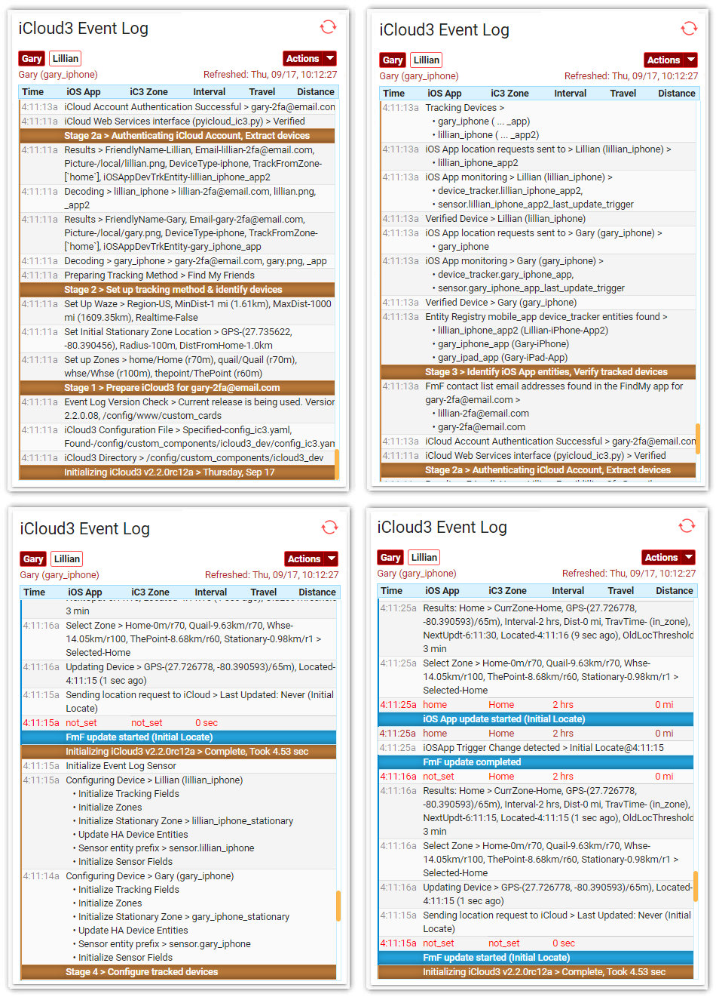

# Setting up iCloud3

This chapter explains how to:

*  How to set up the iCloud3 device_tracker platform
*  How to troubleshoot start up errors and use the Event Log to identify why a phone is not being tracked.


### Setting up the iCloud3 device_tracker platform

The minimum information you need to get iCloud3 running is the username/password of your Apple iCloud account and the phones you want to track. Below are some examples of the configuration parameters that set up a platform using the different tracking methods. The following parameters are used to create the iCloud3 device_tracker.

- username/password - The Apple iCloud account to use to locate the phones (Find-my-Friends  (fmf) and Family Sharing (famshr) tracking methods).
- username - The iOS App is used to locate the phones (iOS App (iosapp) tracking method) .
- tracking_method - fmf (Find-my-Friends), famshr (Family Sharing), iosapp (iOS App)
- track_devices - The phones you want to track.

See Chapter 2.1 Configuration Parameters for more examples and information about these parameters.

!> If you are using the iOS App Tracking method. you do not need a password but you still need a username to identify the device_tracker platform to HA. You can use your email address, your Home Assistant user name or some other text identifier.

You can only have one iCloud3 device_tracker platform in HA. If you want to track phones on different iCloud accounts and they are not in the Family Sharing list, you need to use the Find-my-Friends tracking method or add them to the Family List of the iCloud account you are using. 

When iCloud3 requests location information for an iCloud account, the location of all of the devices associated with that account (friends or family members) are returned. Knowing this, it does not make sense to have different iCloud3 platforms access the same iCloud account. All devices to be tracked should be grouped together.

The following examples will help you get started. The iCloud3 configuration parameters are stored with your other Home Assistant parameters in *configuration.yaml* or another file that is included in *configuration.yaml* when Home Assistant starts.

After you have setup your configuration, restart Home Assistant to load iCloud3.

### Examples of the iCloud3 platform

>Tracking gary and lillian using and gary's iCloud account and the Family Sharing trackingmethod.
>
>```example
>device_tracker:
>- platform: icloud3
>   username: gary-icloud-acct@email.com
>   password: gary-icloud-password
>   tracking_method: famshr
>   track_devices:
>     - gary_iphone > gary.png
>     - lillian_iphone > lillian.png
>```

>Tracking gary and lillian using gary's iCloud account and the  Find-my-Friends tracking method.
>
>```yaml
>device_tracker:
> - platform: icloud3
>   username: gary-icloud-acct@email.com
>   password: gary-icloud-password
>   tracking_method: fmf
>   track_devices:
>     - gary_iphone > gary-icloud-acct@email.com, gary.png
>     - lillian_iphone > lillian-icloud-acct@email.com, lillian.png
>```

>Tracking gary and lillian using the gary's iCloud account and the Find-my-Friends tracking method. The iOS App *device_tracker.gary_iphone_app* and *device_tracker.lillian_iphone_iosapp*  entities will be monitored by specifying the iOS App suffix for the phones.
>
>```yaml
>device_tracker:
> - platform: icloud3
>   username: gary-icloud-acct@email.com
>   password: gary-icloud-password
>   tracking_method: fmf
>   track_devices:
>     - gary_iphone > gary-icloud-acct@email.com, _app, gary.png
>     - lillian_iphone > lillian-icloud-acct@email.com, _iosapp, lillian.png
>```

>Tracking devices using the iOS App
>
>```yaml
>device_tracker:
>- platform: icloud3
>   username: gary-fmf-acct@email.com
>   tracking _method: iosapp
>   track_devices:
>     - gary_iphone > gary.png
>     - lillian_iphone > lillian.png
>```

*Note*: The *gary.png* and *lillian.png* refer to pictures of gary and lillian in the *config/www* directory and are used on the badge sensor discussed in Chapter 2.4 Using Sensors.

#### How location information is used {docsify-ignore}

- iCloud3 updates the device_tracker platform's attributes with information related to the device's location.
- iCloud3 also creates sensors for most of the attributes associated with a device. They can be used on Lovelace cards and in automations and scripts. Using configuration parameters, you can specify the sensors you want to create and not create. See the Sensors chapter for more information.
- When a device's location is polled, the GPS coordinates are returned. This is passed to the Waze Route Calculator to get distance and the travel time to Home or another zone. 

!> When you start iCloud3, a Stationary Zone is created for each device being tracked. Sometimes zone information is not automatically pushed to the iOS App. If that happens the zone enter/exit triggers will not be sent to iCloud3 for the Stationary Zones and you will need to force close the iOS App using the iPhone App Switcher. When you reload it, the zone information is refreshed, which will include the Stationary Zone.

#### iCloud3 Event Log During Initialization {docsify-ignore}

A lot happens when iCloud3 is initialized. The various activities are divided into stages, which include:

* Stage 1 - Preparing iCloud3 - Read the configuration files, validate the Waze Route tracking service, load the zone data and set up the Stationary Zone
* Stage 2 - Verify iCloud Location Services - Determine the tracking method and authorize the iCloud account
* Stage 3 - Set up Tracked Devices - Decode the track_device configuration parameter, determine the iOS App version, analyze the entity registry file and match the the v2 entities with the device.
* Stage 4 - Set up the devices to be tracked - Set the device's Stationary Zone, set up the device's sensors and initialize device related variables to prepare for tracking.

Events are added to the Event Log showing the activity being done during each stage and the results (and problems) of these actions. The following screens are examples of these events.



### Troubleshooting Startup Errors

###### Identifying iCloud3 Startup Errors

Things can go wrong during any of these steps from logging into Apple iCloud, invalid device identification data, not being able to find the device in the iCloud account, location GPS errors, etc. The Event Log can help identify and solve these issues. 

Below are sample screens showing authentication errors and device errors.


#### Trouble Shooting the Family Sharing (FamShr) Tracking Method

##### You get an iCloud3 Error: No devices to track message

iCloud3 scans through the list of devices that have been set up in the Family Sharing part of your iCloud account. If it can not match the devicename with one in the account, that device will not be tracked.  The reasons may include:

1. A message is added to the HA log file and the iCloud3 Event Log with all of the devicenames in the iCloud account Family Sharing list. If the devicename on the track_devices parameter is found in the list, the device will be tracked. If the devicename is not found, it will not be tracked and an error message is displayed.

   Correct the devicename on the track_devices parameter so it matches the name of the device in the `Settings App > General > About > Name field` for the device you want to track. Also see the the 'Chapter 1.1 Getting Started > The phone's name creates the device_tracker entity name`  for information about naming your phone.

2. The username or password is invalid and the account can not be autnenticated. Verify the account can be accessed in the Find My app. If you need additional help, the links in the Apple iCloud Documentation paragraph above are a good source of information.

3. You can not connect to iCloud Location Services. Check the username and password. Check for network errors. 

#### Trouble Shooting the Find-my-Friends (FmF) tracking method 

#####  iCloud3 Error: No devices to track message

This can be caused by the following conditions:

1. The people you want to track have not been added to the `FindMy App > People` list or they have not accepted the locating sharing invitation.
2. Their email address is incorrect on the track_devices parameter.
3. You can not connect to the iCloud Location Services. Check the iCloud account username and password. Check for network errors. 

