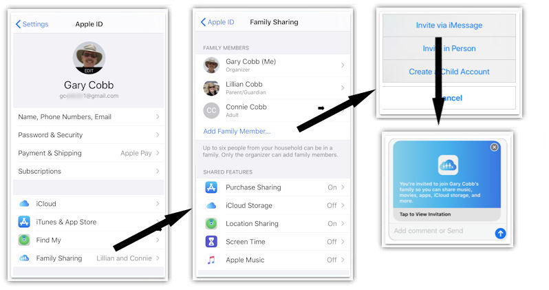
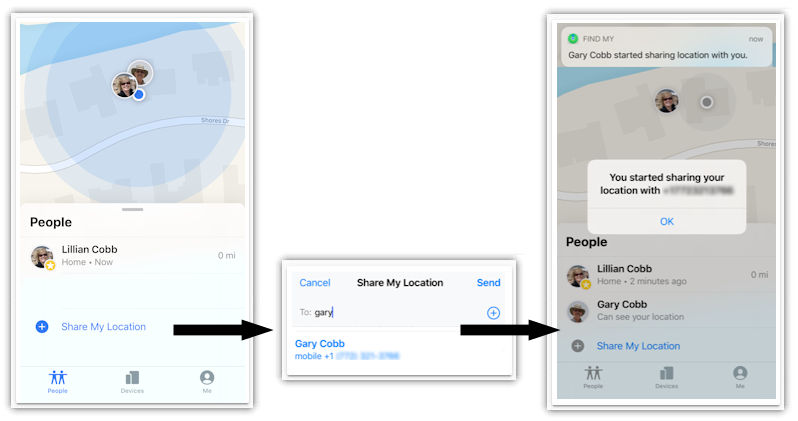

# Setting up your iCloud account


### iCloud3 Tracking Methods

The previous chapter described the tracking methods you can use.

- **iCloud Location Services** - This tracking method combines the two ways iCloud Location Services can provide location information for your phone.

  - **Family Sharing (famshr)** - The people you want to track are on your Family Sharing list on your iCloud account, along with other Apple devices you don't want to track. Remember, when you use this tracking method, iCloud will locate all of the devices whether you are tracking them or not.

  - **Find-My-Friends (fmf)** - Uses the people that you are sharing your location with on the FindMy App. This is probably most efficient method to use since it only tracks people that are in the FindMy people list and lets you track people that are not on your Family Sharing List.
- **iOS App (iosapp)** - This tracking method does not interact with the iCloud account to located the phones and relies only on the iOS App for zone enter/exit and location data. iCloud3 will react to the phone's device_tracker state entity and monitor location changes triggered by various events. It can be used to track the phone when there are problems authenticating and verifying the iCloud account and HA server due to 2fa security issues.   


-----

### Family Sharing Tracking Method and the Settings App

The Family Sharing list is part of your iCloud account and set up on the Settings App.

1. Open the *Settings*.
2. Select  **Your Profile (Apple ID, iCloud, iTunes & App Store)****. 
3. This will open *Your Apple Profile* screen. 
4. Select **Family Sharing** to open the *Family Sharing* screen.
5. Select **Add Family Member** to open the *Invite via iMessage* popup window.
6. Select **Invite via iMessage**. They be added to the Family Sharing List after they accept the invitation. Verify that Location Sharing is turned on on their iPhone.



> Go to Apple the support web site [here](https://support.apple.com/en-us/HT201088) for more information on setting up  and using Family Sharing.


-----

### Find-My-Friends Tracking Method and the The FindMy app

The Find-my-Friends (FmF) tracking method locates the people you have set up on iPhone's ```FindMy App > People``` screen. When they are added, their iCloud account email address adds the phone to the *Share Location* list and is used on the iCloud3 track_devices parameter. 

The person's email address ties the phone being tracked on the iCloud3 track_devices parameter (*gary_iphone*)  to the person on the Share My Location list (*gary-icloud-acct@email.com*).

1. Open the FindMy App.
2. Select **People**. Then select **+ Share My Location**.
3. This will open the *Share My Location* popup window. Select the person to add to the list using their mobile phone number or their email address.
4. Select **Send** to send a sharing invitation to that person. 
5. Open the email requesting approval and the **Accept the invitation**. 
6. Verify that Location Sharing is on turned on their iPhone.



> Go to Apple the support web site [here](https://support.apple.com/en-us/HT210400) for more information on the FindMy App and go [here](https://support.apple.com/en-us/HT201493) for more information on setting up and using Find My Friends.

#### Tracking yourself on the FindMy App

The FindMy app does not let you track yourself. You can not send an email invitation to yourself but you can indicate that this phone should be used to track yourself. Do the following:

- On the *FindMy App > Me* window, scroll down and select the **Use This iPhone as My Location**. 

You will be tracked using the Family Sharing tracking method.

*Note:* If you have been using an iPhone when there was a Find-my-Friends app and a Find-my-Device app (before they were combined into the FindMy app in iOS v14), your email address may be in your Find-my-Friends list. If so, you will be the Find-my-Friends tracking method will be selected for you if you specified your email address in the configuration parameters. When iCloud3 starts, all of emails that are available is displayed in the Event Log - Stage 2a initialization.


-----

### iOS App Tracking Method

To use this tracking method, you must install the iOS App on each phone you are tracking and associate the device_tracker entity names with the track_devices configuration parameter. This is described in detail in chapter *1.4 Setting up the iOS App*.