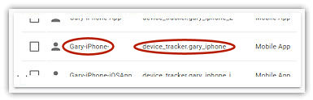

# Setting up the iOS App

### Install and prepare the iOS App

The iOS App needs to be installed on every phone you are tracking and the mobile_device integration needs to be set up in Home Assistant. Extensive documentation on the iOS App can be found [here](https://companion.home-assistant.io/).

1. Download and install the iOS App from the Apple iCloud store.
2. Add the mobile_app integration using the *HA Sidebar > Configuration > Integrations* screen. The process is described in the HA documentation.

#### Add a Suffix *device_tracker entity* Name created by the iOS App

!> The iOS App device_tracker entity name must be different than the iCloud/iCloud3 device_tracker name.

*Note:* These instructions are based on HA 0.114 and subject to change. 

A suffix must be added onto the device_tracker Entity ID so it is not the same as the iCloud and iCloud3 name. It can be a number (*_2, _3*, etc.) or text (*_app, _iosapp*, etc.). Do the following:

1. On your main Home Assistant screen, select `HA Sidebar > Configuration > Entities`. This will display a list of your Entities. Select the **Entities** heading to sort by Entity ID.

2. Scroll to the *Mobile App* section for the device_tracker entity of the phone you are setting up.

3. Select it (e.g., *Gary-iPhone*) to open the Update window.

4. Change the **Name Override** field to add the suffix (i.e., *Gary-iPhone*  to  *Gary-iPhone-2 or *Gary-iPhone-App*, etc.). This will let you identify the iOS App entity in the HA History logs.
5. Change the **Entity ID** field to add the suffix (i.e., *device_tracker.gary_iphone*  to  *device_tracker.gary_iphone_app* or *device_tracker.gary_iphone_iosapp*, etc.)
6. Select **Update**.
7. Restart Home Assistant to load the new device_tracker entity name.  

#### iOS App Settings

Every phone you are tracking with iCloud3 must have the iOS App installed on it, whether you are using the iOS App or not.

!> If you do not install the iOS App on the phone being tracked, an error message is displayed in the Event Log that the iOS App device_tracker entity can not be found.

The following are iOS App screenshots showing how the app should be configured.

- **Notification screen** - A notification is displayed on the phone when these events occur. They should be set to *On* during the installation iCloud3 phase and can be turned off once you have verified everything is working correctly.
- **Location screen** - The highlighted fields control how triggers are sent to HA and iCloud3 from the iOS App and must be the values indicated. If Location Permission is *Never* and the other items are *Off*, triggers will not be sent and the iOS App will be Inactive.
- **General screen** - Various messages and location requests are sent to the Device Name. This name is automatically detected when iCloud3 starts.

