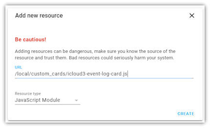

# Installing iCoud3 and the Event Log


### Installing iCloud3 using HACS (Home Assistant Community Store)

iCloud3 is listed on the default HACS Repositories/Integrations page and can be to Home Assistant using HACS. Do the following:

1. Display the HACS control panel. Then type `icloud3` in the 'Please enter a search term...' field.
2. The `iCloud3 Device Tracker` card is displayed, Select it.
3. Click `Install`. This will install all of the custom component files above into the 'config/custom_components/icloud3' directory on your Raspberry Pi or the device you are running Home Assistant on.
4. Log onto your Pi.
5. Install the `iCloud3 Event Log` card using the procedures below. The `icloud3-event-log-card-js` is installed in the `config/custom_components/icloud3` directory with the other files.
6. Set up the iCloud3 device_tracker configuration parameters. Instructions, including examples, are found in the Setting up iCloud3 chapter.
7. Restart Home Assistant.

!> The Waze Route Calculator component is use to calculate driving distance and time from your location to your Home or another zone). Normally, it is installed with the Home Assistant and Hass.io framework. However, if it is not installed on your system, you can go [here](https://github.com/kovacsbalu/WazeRouteCalculator) for instructions to download and install Waze. If you don't want to use Waze or are in an area where Waze is not available, you can use the 'direct distance' method of calculating your distance and time from the Home or another zone. Add the `distance_method: calc` parameter to your device_tracker: icloud3 configuration setup (see the Parameters, Attributes and Sensors section for more information).

!> iCloud3 logs information to the HA log file and to an internal table that can be viewed using the iCloud3 Event Log Lovelace Custom Card. Information about this custom card, and installation instructions are in the Support Programs chapter.   


-----

### Installing the Event Log

Typically Lovelace custom cards are stored in their own directory that is within the `config/www/` directory. iCloud3 and the instructions below, use the `www/custom_cards` directory although you may be storing them in another location (e.g.,`www/community`). 

!>If you are not using the `www/custom_cards` directory, use your directory name (e.g., `www/community`) instead of `www/custom_cards` in the following instructions. Then, use the iCloud3 *event_log_card_directory: www/yourcustomcarddirectoryname* configuration parameter to specify your directory name.

When iCloud3 is installed, the Event Log card source code (*icloud3-event-log-card.js*) is also installed. When iCloud3 starts the source code in the *www/custom_cards* directory is checked to see if the latest version is installed. The source code will be copied to the *www/custom_cards* directory if it doesn't exist or a newer version is available.

#### Setting up the Lovelace Resource for the Event Log Using the HA Configurator

The Event Log must be setup as a Lovelace Resource before it can be used. This can be done using the HA Configurator.

Do the following:

1. Select **HA Sidebar > Configuration > Lovelace Dashboard**s. Select **Resources** at the top of the screen.
2. Click the **Add button** ('**+**') in the lower-left.
3. Enter the iCloud3 Event Log custom card file location in the url field in the following window:   
   
4. Select **Create**.

You will now be able to add the Event Log to your Lovelace cards.  


-----

### HA History Database - Do not add iCloud3 Events to it

The *sensor.icloud3_event_log* entity is used to pass events from iCloud3 to the Event Log. The size of the text in this sensor can become very large after you have been running HA for a while. There is no need to record this entity in the HA database every time it changes. To prevent this, add the following to your *configuration.yaml* file:

```
recorder:
  purge_keep_days: 3
  exclude:
    entities:
      - sensor.icloud3_event_log
```

More information on configuration the *recorder* can be found in the HA documentation [here](https://www.home-assistant.io/integrations/recorder/).

Below is an example of the error that may occur if you do not exclude the *sensor.icloud3_event_log*.

```
2020-10-31 16:11:11 ERROR (Recorder) [homeassistant.components.recorder] Error executing query: (MySQLdb._exceptions.DataError) (1406, "Data too long for column 'attributes' at row 1")
[SQL: INSERT INTO states (domain, entity_id, state, attributes, event_id, last_changed, last_updated, created, old_state_id) VALUES (%s, %s, %s, %s, %s, %s, %s, %s, %s)]
[parameters: ('sensor', 'sensor.icloud3_event_log', ...', 13414815, datetime.datetime(2020, 10, 31, 15, 1, 10, 494582, tzinfo=datetime.timezone.utc), datetime.datetime(2020, 10, 31, 15, 1, 10, 494582, tzinfo=datetime.timezone.utc), datetime.datetime(2020, 10, 31, 15, 1, 10, 494716, tzinfo=datetime.timezone.utc), 12914612)]
(Background on this error at: http://sqlalche.me/e/13/9h9h)
Traceback (most recent call last):
  File "/usr/local/lib/python3.8/site-packages/sqlalchemy/engine/base.py", line 1276, in _execute_context
    self.dialect.do_execute(
  File "/usr/local/lib/python3.8/site-packages/sqlalchemy/engine/default.py", line 593, in do_execute
    cursor.execute(statement, parameters)
  File "/usr/local/lib/python3.8/site-packages/MySQLdb/cursors.py", line 206, in execute
    res = self._query(query)
  File "/usr/local/lib/python3.8/site-packages/MySQLdb/cursors.py", line 319, in _query
    db.query(q)
  File "/usr/local/lib/python3.8/site-packages/MySQLdb/connections.py", line 259, in query
    _mysql.connection.query(self, query)
MySQLdb._exceptions.DataError: (1406, "Data too long for column 'attributes' at row 1")
```


-----

### Installing iCloud3 Manually

iCloud3 uses the GitHub Releases framework to download all the necessary installation files (iCloud3 custom component, documentation, sample configuration files, sample Lovelace cards, etc). Go to the 'Releases' tab at the top of this repository, select the version of iCloud3 you want and download the .zip file. 

1. Create a `config/custom_components/icloud3` directory on the device (Raspberry Pi) running Home Assistant. Copy the five component files in the `custom_components-icloud3` GitHub directory (`device_tracker.py, pyicloud_ic3.py, init.py, manifest.json, services.yaml`)  into that directory so the directory structure looks like:

```yaml
config
  custom_components
    icloud3
      device_tracker.py
      pyicloud_ic3.py
      __init__.py
      manifest.json
      services.yaml
```

3. Set up the iCloud3 device_tracker configuration parameters. Instructions, including examples, are found in the Setting up iCloud3 chapter.
4. Restart Home Assistant.


-----

#### Setting up the Lovelace Resource Manually

Open the `configuration.yaml` file and add the following lines to the lovelace resources parameter. Again, change the directory name if you are using a different location.

>Example using *'www/custom_cards'*
>
>```
>lovelace:
>mode: yaml
>resources:
>- url: /local/custom_cards/icloud3-event-log-card.js
>type: module
>```

>Example using *'www/community'*
>
>```
>lovelace:
>mode: yaml
>resources:
>- url: /local/community/icloud3-event-log-card.js
>type: module
>```


