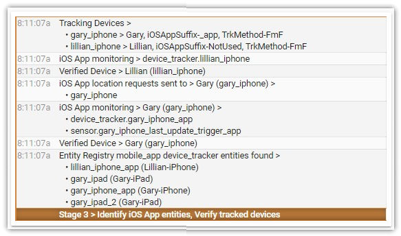

# Configuring and Starting iCloud3


### Setting up the iCloud3 device_tracker platform

#### Using iCloud Location Services and the iOS App

The minimum information you need to get iCloud3 running is the username/password of your Apple iCloud account and the phones you want to track. The following parameters are used to create the iCloud3 device_tracker.

- **username** - The Apple iCloud account to use to locate the phones (Find-my-Friends  (fmf) and Family Sharing (famshr) tracking methods).
- **password** - The password of the iCloud account .
- **devices** - The phones you want to track. Each phone is defined by it's *device_name* parameter.

See the examples below and *Chapter 2.1 Configuration Parameters* for more examples and information about these parameters.

You can only have one iCloud3 device_tracker platform in HA. If you want to track phones on different iCloud accounts , you need to set the up on the FindMy App and specify their email address. iCloud3 will assign the Find-my-Friends tracking method to that phone or add them to the Family List of the iCloud account you are using. 

#### Using only the iOS App in Method

The minimum information you need to get iCloud3 running using the iOS App tracking method is the username, the tracking method and the phones you want to track. 

- **username** - The email address of the of the primary user.
- **tracking_method: iosapp** - Indicates the iOS App is used to locate the phones .
- **devices** - The phones you want to track. Each phone is defined by it's *device_name* parameter.

The following examples will help you get started. The iCloud3 configuration parameters are stored with your other Home Assistant parameters in *configuration.yaml* or another file that is included in *configuration.yaml* when Home Assistant starts.

After you have setup your configuration, restart Home Assistant to load iCloud3.  


-----

### The Configuration Files - *configuration.yaml* and *config_ic3.yaml*

The *configuration.yaml* is used by Home Assistant to set up all the devices, entities and integrations. The iCloud3 platform is also set up in this file. iCloud3, however, can also use it's own configuration file, *config_ic3.yaml*, to specify it's parameters  that control how it operates. The benefits to splitting up the iCloud3 parameters are:

- The iCloud3 parameters are separate from the HA configuration parameters from an organization point-of-view.
- The iCloud3 parameters can be changed and iCloud3 can be restarted without restarting Home Assistant.

When iCloud3 starts, it reads all the parameters specified in *configuration.yaml* and then reads the *config_ic3.yaml* file and merges the parameters together. The following points describe what goes on and the best way to set it up:

- The *config_ic3.yaml* file should be located in the */config* directory with the other HA configuration files. 
- You can specify another file name for this file using the *config_ic3_file_name* parameter.
- You can change the parameter values in *config_ic3.yaml* and restart iCloud3 using the *Event Log > Actions > Restart iCloud3 command*.
- The following parameters must be in the HA *configuration.yaml* file 
  - username
  - password - if using iCloud Family Sharing or Find-m-Friends tracking method. This is not needed if using the iOS App tracking method.
  - create_sensors
  - exclude_sensors
  - entity_registry_file_name
  - config_ic3_file_name
- All other iCloud3 configuration parameters can be in *config_ic3.yaml*.
- The sample configuration file, *config_ic3_sample.yaml*,  is installed in the */config/custom_components/icloud3* directory when iCloud3 is updated. It shows all of the available parameters and their default values. 
- iCloud3 searches for the file in the following order:

    | Order | *config_ic3_file_name* parameter used | File Name                                              | Criteria                                                     |
    | ----- | ------------------------------------- | ------------------------------------------------------ | ------------------------------------------------------------ |
    | 1.    | Yes                                   | *DirectorySpecified/FileNameSpecified*                 | Directory and file name are specified (*/config/config_ic3-gc.yaml*). |
    | 2.    | Yes                                   | /config/*FileNameSpecified*                            | File name only is  specified (*config_ic3-gc.yaml*).         |
    | 3.    | Yes                                   | /config/custom_components/icloud3 /*FileNameSpecified* | File name only is specified and the file is not in the */config* directory (*config_ic3-gc.yaml*). |
    | 4.    | No                                    | /config/config_ic3.yaml  **(Default)**                 | *config_ic3.yaml* file exists in the */config* directory.    |
    | 5.    | No                                    | /config/custom_components/icloud3 /config_ic3.yaml     | *config_ic3.yaml* file does not exist in the *config* directory but does in the */config/custom_compontents/icloud3* directory. |
    | 6.    | No                                    | None                                                   | No *config_ic3.yaml file exists.                             |

!> It is not recommended to locate the file in the */config/custom_components/icloud3* directory. HACS deletes all files in the icloud3 directory when it does an update.

The following example shows the configuration file set up:

- */config/configuration.yaml* file
    ```
    device_tracker:
      - platform: icloud3
        username: gary_icloud_account@email.com
        password: gary_icloud_account_password
    exclude_sensors: batstat,lzonn,lzont,name
    ```
    
- */config/config_ic3.yaml* file
    ```yaml
    devices:
      - device_name: gary_iphone
        email: gary_456@email.com
        name: Gary
        picture: gary.png
      - device_name: lillian_iphone
        email: lillian_789@email.com
        name: Lillian
        picture: lillian.png
    
    Other icloud3 parameters you want to specify
    ```

-----

### Configuration parameters specify the phones to be tracked

The *devices* parameter specifies all of the phones (or other devices) to be tracked. It can be in the *configuration.yaml* or the *config_ic3.yaml* file. Each phone is defined using the *- device_name: [devicename]* parameter. Additional parameters specify other information about the phone. The parameters are:

- **device_name** - (Required) The phone's name used in your iCloud account to identify the phone. It is the same as the one in the *Settings App > General > About > Name field*. 

  - You can not have more than one device with the same name. 
  - If you are tracking more than one device for the same person, e.g., a phone and a watch, each one must have a different name.

- **name** - (Optional) The name that is displayed in the Event Log and in other messages of the person using the phone. You should keep it short and it is not necessary to include the type of device unless you are tracking more than one device for the same person. The *name* will be extracted from the *device_name* parameter by iCloud3 if it is not specified.

- **email** - (Optional) The person's email address if they have been sent an invitation to share their location in the FindMy App.  

  - If you are tracking more than one device for the same person, only the primary device should have an email address. 
  - If this is specified, it is considered as a candidate for the Find-my-Friends tracking method. 
  - If it is not specified, the Family Sharing tracking method is assigned.

- **picture** - (Optional) The jpg or png file name of the person using the phone that is used on the *badge_sensor* for the person.  The file is normally in the */config/www/* directory (or */local* in HA). You can use the full name (*/local/gary.png*) or an abbreviated name (*gary.png*). See the Badge Sensor in the Sensor chapter for more information about the sensor_badge.

- **track_from_zone** - (Optional, not normally used) The name of an additional zone(s) you want to monitor. This will create additional sensors with it's distance and travel time calculations that can be used in automations and scripts. See the Sensors chapter for more information. The Home zone is always monitored so only specify this parameter if you want to monitor an additional zone.

- **device_type** - (Optional, not normally used) The device type is identified by scanning the *device_name* parameter or by extracting it from the data returned from iCloud Location Services when iCloud3 starts. This overrides the value extracted from the *device_name* parameter.

- **iosapp_installed**  
(Optional) Indicates if iCloud3 should monitor the iOS App. 
*Valid values:* True, False,  *Default:* True
*Note:* This is the opposite of the depreciated *noiosapp* parameter but is a little more meaningful. *iosapp_installed: False* is the same as *noiosapp: True*. 

- **inzone_interval**   
(Optional) The interval between location updates when the device is in a zone.  This can be in seconds, minutes or hours, e.g., 30 secs, 1 hr, 45 min, or 30 (minutes are assumed if no time qualifier is specified).  
*Note:* If this parameter is not specified for the device, the values in the *inzone_intervals* parameter is used to set the time between polling when the device is in a zone.

- **iosapp_suffix** - (Optional, not normally used) (Do not specify this parameter if you specify the iosapp_entity parameter) iCloud3 scans the HA Entity Registry for devices with a name that starts with the *device_name*. It extracts the *suffix* added to the *device_name* when the iOS App integration was added to HA and monitors that entity for zone enters/exits and location updates. 

  If the integration was added several times, there may be more than one suffix for the device in the registry. If so, iCloud3 uses the last one added. Use this parameter if you want to use a specific suffix. An example might be ' _app ' or  ' _2'.

- **iosapp_entity** - (Optional, not normally used)  (Do not specify this parameter if you specify the iosapp_suffix parameter)The full name of the iOS App device_tracker entity (without the *device_tracker.* part) that is used to monitor the entity for zone enters/exits and location updates. *This is used if you have assigned an entity name that does not start with the iCloud/iCloud3 device name and iCloud3 can not determine the mobile_app entity to monitor.* 

##### *Depreciated parameters:*

- **noiosapp: true** - (Depreciated, Optional, not normally used) This phone does not have the iOS App installed on it so no iOS App entities should be monitored.

#### How the phone's tracking method is selected

Each phone will automatically select the appropriate tracking method based on how the phone's parameters are configured:

- If the email address is specified for the phones and all phones are in the *FindMy* list, the location of all the phones in the *FindMy* list are located with one request. 
- If the email address is specified for the phones and one phone is not in the *FindMy* list but all are in the *Family Sharing List*, the location of all of the phones in the *Family Sharing* list are located with one request. Actually, iCloud locates all phones in the list, whether-or-not the phone is being tracked. If you have a large list, it will take a slightly longer for iCloud to locate all the phones than the above method.
- If the email address is specified for the phones and one phone is not in the *FindMy* list and another phone is not in the *Family Sharing List*, then it will take two requests to locate all the phones being tracked.

#### Examples of the *devices* parameter

The following examples show different methods of tracking phones. See *Chapter 2.1 Configuration Parameters* for the complete list of the parameters that can be used to control how iCloud3 operates.

> The parameters for the phones to be tracked can be specified in the *config_ic3,yaml* file.


>Track Gary and Lillian's phone.
>
>```example
>devices:
>  - device_name: Gary-iPhone				(or gary_iphone)
>    email: gary_456@email.com
>    name: Gary
>    picture: gary.png
>  - device_name: Lillian-iPhone			(or lillian_iphone)
>    email: lillian_789@email.com
>    name: Lillian
>    picture: lillian.png
>```


>Track Gary and Lillian's phone. The iOS App *device_tracker.gary_iphone_app* and *device_tracker.lillian_iphone_iosapp*  entities will be monitored by specifying the iOS App suffix for the phones. 

>```yaml
>devices:
>  - device_name: Gary-iPhone				(or gary_iphone)
>    email: gary_456@email.com
>    name: Gary
>    picture: gary.png
>    iosapp_suffix: _app
>  - device_name: Lillian-iPhone			(or lillian_iphone)
>    email: lillian_789@email.com
>    name: Lillian
>    picture: lillian.png
>    iosapp_suffix: _iosapp
>```


>Track Gary and monitor the iOS App *device_tracker.gary_iphone_iosapp2* entity.

>```yaml
>devices:
>- device_name: gary_iphone				(or Gary-iPhone)
>  email: gary_456@email.com
>  name: Gary
>  picture: gary.png
>  iosapp_entity: gary_iphone_iosapp2
>  device_type: iPhone
>  inzone_interval: 1 hr
>```


>Track Gary and also create the sensors with distance and travel time for the *warehouse* zone, Track Lillian's Watch, the iOS App is not installed and the inzone interval is set to 15 minutes..
>
>```yaml
>devices:
> - device_name: Gary-iPhone
>   email: gary_456@email.com
>   name: Gary
>   picture: gary.png
>   track_from_zone: warehouse
> - device_name: Lillian-Watch
>   name: L-Watch
>   picture: Lillian.png
>   inzone_interval: 15 min
>   iosapp_installed: False
>```

*Note*: The *gary.png* and *lillian.png* refer to pictures of gary and lillian in the */config/www* directory and are used on the badge sensor discussed in *Chapter 2.4 Using Sensors*.

#### How location information is used {docsify-ignore}

- iCloud3 updates the device_tracker platform's attributes with information related to the device's location.
- iCloud3 also creates sensors for most of the attributes associated with a device. They can be used on Lovelace cards and in automations and scripts. Using configuration parameters, you can specify the sensors you want to create and not create. See the Sensors chapter for more information.
- When a device's location is polled, the GPS coordinates are returned. This is passed to the Waze Route Calculator to get distance and the travel time to Home or another zone. 

!> When you start iCloud3, a Stationary Zone is created for each device being tracked. Sometimes zone information is not automatically pushed to the iOS App. If that happens the zone enter/exit triggers will not be sent to iCloud3 for the Stationary Zones and you will need to force close the iOS App using the iPhone App Switcher. When you reload it, the zone information is refreshed, which will include the Stationary Zone.


-----

### iCloud3 Event Log During Initialization

A lot happens when iCloud3 is initialized. The various activities are divided into stages, which include:

###### Stage 1 - Preparation

Read the configuration files, validate the Waze Route tracking service, load the zone data and set up the Stationary Zone.


###### Stage 2 - Read and Edit the configuration parameters

Decode the *devices* configuration parameter, extract the devices to be tracked and their associated parameters.


###### Stage 2a - Set up Tracked Devices for the iCloud tracking method.

Show the devices that have been returned from iCloud Location Services that can be located and tracked.


###### Stage 2b - Set up Tracked Devices for the Family Sharing and Find-my-Friends tracking methods.

Decode the track_device configuration parameter, determine the iOS App version, analyze the entity registry file and match the the v2 entities with the device.


###### Stage 3 - Identify the iOS App mobile_device entities.

Scan the HA Entity Registry and match the devices being tracked with their iOS App device tracker entities.



###### Stage 4 - Configure the tracked devices

Complete the setup process for each device being tracked.


