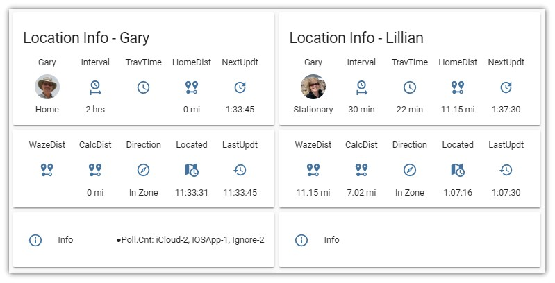
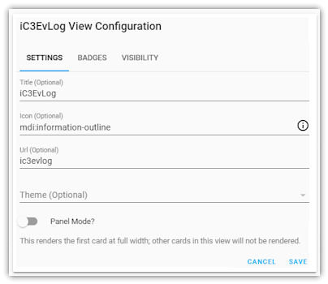
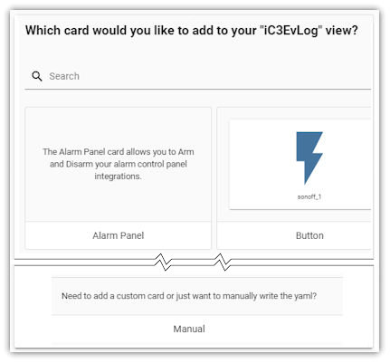
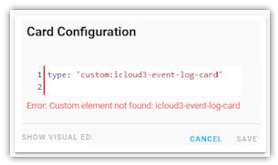
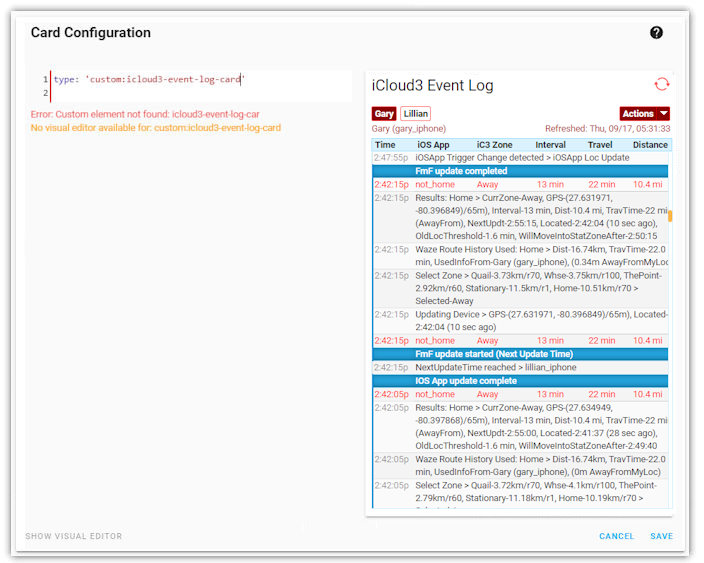

# Set up a Lovelace Card for iCloud3

There are many sensors created by iCloud3 that can be used in scripts, in automations and on Lovelace cards. These sensors are described in [Chapter - 2.4 Using Sensors](). A sample of one of the cards is shown below to get you going. Other examples are shown [Chapter - 3.1 Sample Lovelace Cards](). 

The sample lovelace cards also show the raw yaml code that generates them. You can use these cards as a starting place for the devices you are tracking by copying and customizing the setup in the *HA Sidebar > Lovelace* windows.




```yaml
  - title: Location (Gary)
    icon: mdi:cellphone-iphone
    cards:
      - type: vertical-stack
        cards:
          - type: glance
            title: Location Info - Gary
            column_width: 20%
            entities:
              - entity: device_tracker.gary_iphone
                name: Gary
              - entity: sensor.gary_iphone_interval
                name: Interval
                icon: mdi:clock-start
              - entity: sensor.gary_iphone_travel_time
                name: TravTime
                icon: mdi:clock-outline
              - entity: sensor.gary_iphone_zone_distance
                name: Home
                icon: mdi:map-marker-distance 
              - entity: sensor.gary_iphone_next_update
                name: NextUpdt
                icon: mdi:update
         
          - type: glance
            column_width: 20%
            entities:
              - entity: sensor.gary_iphone_waze_distance
                name: WazeDist
                icon: mdi:map-marker-distance
              - entity: sensor.gary_iphone_calc_distance
                name: CalcDist
                icon: mdi:map-marker-distance
              - entity: sensor.gary_iphone_dir_of_travel
                name: Direction
                icon: mdi:compass-outline
              - entity: sensor.gary_iphone_last_located
                name: Located
                icon: mdi:map-clock
              - entity: sensor.gary_iphone_last_update
                name: LastUpdt
                icon: mdi:history
              
          - type: horizontal-stack
            cards:
            - type: entities
              entities:
                - entity: sensor.gary_iphone_info
                  name: Info
                  icon: mdi:information-outline 

#-------------------------------------------------------------------------              
      - type: vertical-stack
        cards:
          - type: glance
            title: Location Info - Lillian
            column_width: 20%
            entities:
              - entity: device_tracker.lillian_iphone
                name: Gary
              - entity: sensor.lillian_iphone_interval
                name: Interval
                icon: mdi:clock-start
              - entity: sensor.lillian_iphone_travel_time
                name: TravTime
                icon: mdi:clock-outline
              - entity: sensor.lillian_iphone_zone_distance
                name: HomeDist
                icon: mdi:map-marker-distance 
              - entity: sensor.lillian_iphone_next_update
                name: NextUpdt
                icon: mdi:update
         
          - type: glance
            column_width: 20%
            entities:
              - entity: sensor.lillian_iphone_waze_distance
                name: WazeDist
                icon: mdi:map-marker-distance
              - entity: sensor.lillian_iphone_calc_distance
                name: CalcDist
                icon: mdi:map-marker-distance
              - entity: sensor.lillian_iphone_dir_of_travel
                name: Direction
                icon: mdi:compass-outline
              - entity: sensor.lillian_iphone_last_located
                name: Located
                icon: mdi:map-clock
              - entity: sensor.lillian_iphone_last_update
                name: LastUpdt
                icon: mdi:history
          - type: entities
            entities:
              - entity: sensor.lillian_iphone_info
                name: Info
                icon: mdi:information-outline 

```


-----

### Add the Event Log to a Lovelace card

#### Configurator Mode - Setting up the Lovelace Dashboard Card

Do the following:

1. Select  **HA Sidebar > YourDashboard** where *YourDashboard* is the Lovelace card you want to add the Event Log card to.

2. Select the 3-dots in the upper-right corner (Open Lovelace UI Menu). Then select **Configure UI**.

3. Continue with the *Using the Raw Configuration Editor* or *Using the Lovelace Configuration Windows* below.

##### Using the Raw Configuration Editor

4. Select the **3-dots** in the upper right-hand corner of the screen to open the Selection Window, 
5. Select **Raw Configuration Editor**. The actual yaml code controlling the Lovelace dashboards, views and cards is displayed. 
6. Add the iCloud3 Event Log Card code below starting at the end of the file, then Select **Save**.


	badges: []
	  cards:
	    - type: 'custom:icloud3-event-log-card'
	      icon: 'mdi:information-outline'
	      path: icoud3-event-log
	      title: iCoud3 Event Log

##### Using the Lovelace Configuration Windows

4. Select the **Plus Sign (+)** sign to add a new view to the View Configuration window.
   
5. Fill in the **Title** and **Icon** fields. Select **Save**. The example below uses iC3EvLog for the title but you can use what ever you want. The icon, if specified, will be displayed on the dashboard.
   
6. Select the **Plus Sign (+)** (Add Card) on the right side of the window to select the custom card to be added.
   
7. Scroll to the bottom of the list and select *Manual* to display the add Card Configuration window.
   
8. Type **custom:icloud3-event-log-card** in the *Type* field. Then Select **Save**.
   
9. The iCloud3 Event Log will be displayed. Then Select **Save** to update your lovelace configuration..
   

More information is found in the Home Assistant Lovelace documentation regarding setting up and using custom cards. Be sure to refer to it if you have any problems. Go [here](https://community.home-assistant.io/t/how-do-i-add-custom-cards-with-the-lovelace-ui/97902) for more information if you are not using the `ui-lovelace.yaml` file to set up your cards.

#### yaml Mode - Setting up the Lovelace Dashboard Card

Add the following lines to the Lovelace Dashboard/Card in the *ui-lovelace.yaml* file that will display the Event Log.

```
    - title: iCloud Event Log
      icon: mdi:information-outline 
      cards: 
        - type: custom:icloud3-event-log-card
          entity: sensor.icloud3_event_log
```

