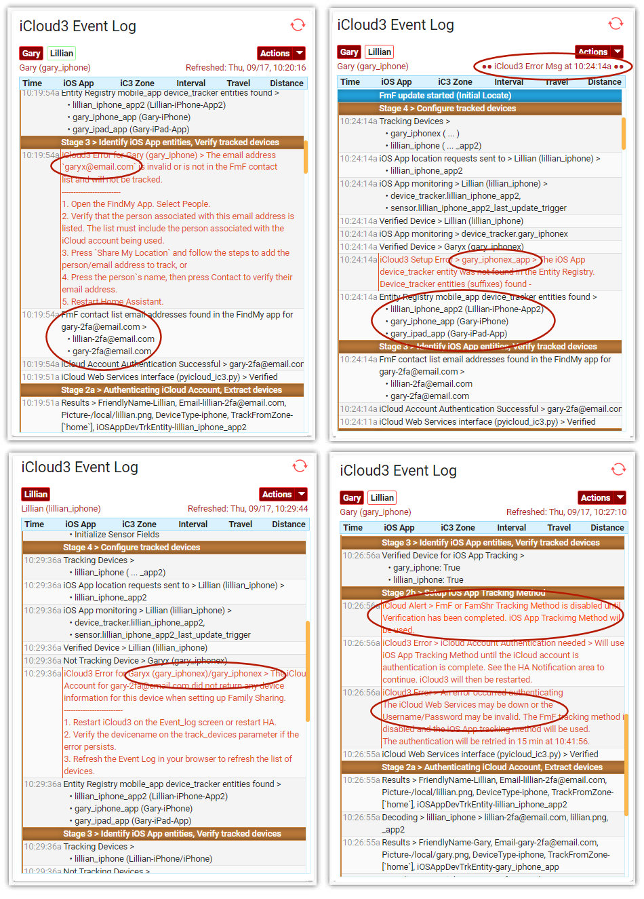

# Troubleshooting Startup Errors

Things can go wrong during any of these steps from logging into Apple iCloud, invalid device identification data, not being able to find the device in the iCloud account, location GPS errors, etc. The Event Log can help identify and solve these issues. 

Below are sample screens showing authentication errors and device errors.

The following messages may be displayed.

### No devices to track message
iCloud3 scans through the list of devices that have been set up in the Family Sharing list and the Find-my-Friends (FindMy App) and lists them in Stage 2a as shown above. If it can not match the device name in the Family Sharing list or the email in the Find-my-Friends list, that device will not be tracked. The reasons may include:

1. The device name does not match the names in the phone's General > Setting > About > name field.
2. The email address of the person to follow is incorrect.
3. The person that was send an invitation to be share their location has not accepted the invitation.
5. The person you want to follow was never sent an invitation from the FindMy App.
6. The username or password is invalid and the account can not be authenticated. 
7. You can not connect to iCloud Location Services.

### The iOS App device_tracker entity was not found in the Entity Registry

The iCloud3 device_name (gary_iphone), the name on the phone (Gary-iPhone) *(Settings App > General > About > Name)* and the name in the iOS App (Gary-iPhone) *(HA Sidebar > App Configuration > General > Name field)* must be the same. When the iOS App mobile app integration is added to HA, a suffix is added to make it's entity id unique. More about this is in chapter *1.4 Setting up the iOS App*.

iCloud3 scans the entity registry when it starts or is restarted on the Event Log > Actions > Restart iCloud3 looking for the a mobile app device_tracker entity starting with the device_name and ending with a suffix (gary_iphone_2). This error is displayed when  searching for a device_tracker entity that starts with the device_name and ends with a suffix and no device_tracker entity was found. The reasons may include:
1. The device_name configuration parameter is not correct. iCloud3 displays the mobile app device_tracker entities it found in the Event Log > Stage 3. Review the list and correct the name on the configuration parameter.
2. The name in the App Configuration is different than the one on the phone or the device_name in the configuration parameters. Correct them so they all are the same.
3. The name is the same but the iOS App was added before iCloud3. In this case, the mobile app device_tracker will not have a suffix (gary_iphone). HA may then add a suffix onto the device tracker entity for iCloud3 (gary_iphone_3). Since the iCloud3 name and the iCloud account must be the same, add a suffix to the device_tracker entity name for the mobile app using the HA Configuration > Entities window and restart HA.

### The phone does not go to an Away state when you exit a zone

Not changing to Away when you leave a zone means iCloud3 is not getting the zone exit trigger from the iOS app. Check the following:

1. The device name for the iOS app is not the same as the phone and the device name parameter. Check it at *General > Name* field in the iOS app. See [Chapter 1.2 Getting Started/iCloud Account → iCloud3 ← iOS App](1.2-getting-started?id=icloud-account-→-icloud3-←-ios-app) for more information.
2. The HA mobile app integration is not installed. Install it at *Configuration > Integrations*. See *Chapter 1.4 Setting up the iOS App/Install and prepare the iOS  App* for more information.
3. The suffix assigned to the iOS app device_tracker entities are not being recognized by icy. Check Stage 3 and Stage 4 for the entities being monitored in the Event Log.
4. The iOS app device_tracker.[devicename]_[suffix] entities are not being updated by the iOS app. Check the Developer Tools > States for the device tracker entities to see if they show the zone name when you are in a zone and not_home when you are not in a zone.
5. Review the iOSapp Monitor in the Event Log to see if any iOS app triggers are being detected. Check the Event Log > Actions > Show iOSapp Monitors. Look at the state change and trigger change values and times they changed.