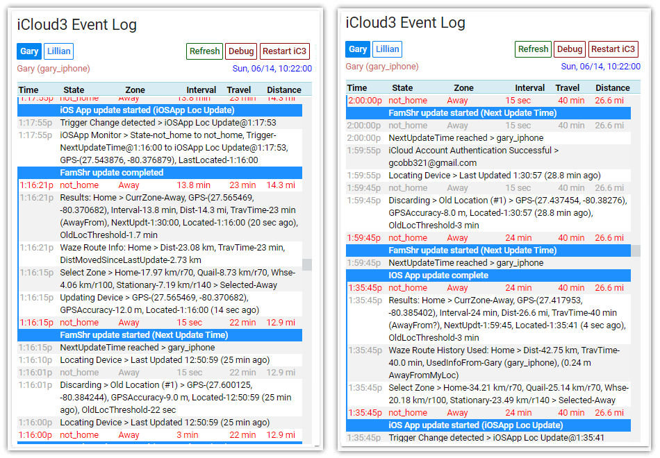

# Support Programs

### About the iCloud3 Event Log Custom Card

As iCloud3 runs, various entries are written to the HA log file that show device information, how it is tracked, operational errors, startup information and other items that may help determine what is going on if there is a problem and to monitor when the device's information is determined and updated. A lot of this information is also written to the `iCloud3 Event Log` which can be viewed using the `iCloud3 Event Log Lovelace Card`. 

Below are 3 screens. The one on the left shows iCloud3 starting up, the middle one shows arriving Home and the one on the right shows entering the 'Whse' zone.



### Installing the iCloud3 Event Log Custom Card

Custom Lovelace cards are typically stored in the `/www/custom_cards` directory. Do the following:

1. Create the `/www/custom_cards` directory if it does not exist. 

2. Copy the `icloud3-event-log-card.js` into the `/www/custom-cards` directory. If you are already using custom cards and they are in a different directory,  copy the `icloud3-event-log-card.js` file into the one you are using.

3. Open the `ui-lovelace.yaml` file and add the following lines to the beginning of the file. Again, change the directory name if you are using a different location.

   ```
   resources:
     - url: /local/custom_cards/icloud3-event-log-card.js?v=1.000
       type: js
   ```

4. Add the following lines to the `ui-lovelace.yaml` file to create the custom card. 

   ```
    - title: iCloud Event Log
      icon: mdi:information-outline 
      cards: 
        - type: custom: icloud3-event-log-card
          entity: sensor.icloud3_event_log
   ```

More information is found in the Home Assistant Lovelace documentation regarding setting up and using custom cards. Be sure to refer to it if you have any problems. Go [here](https://community.home-assistant.io/t/how-do-i-add-custom-cards-with-the-lovelace-ui/97902) for more information if you are not using the `ui-lovelace.yaml` file to set up your cards.
