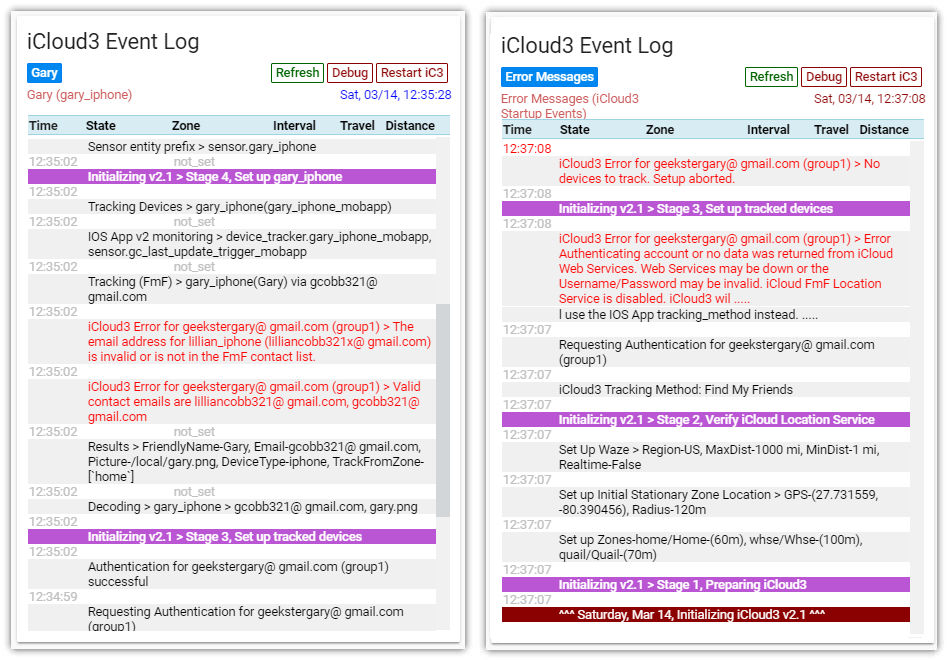
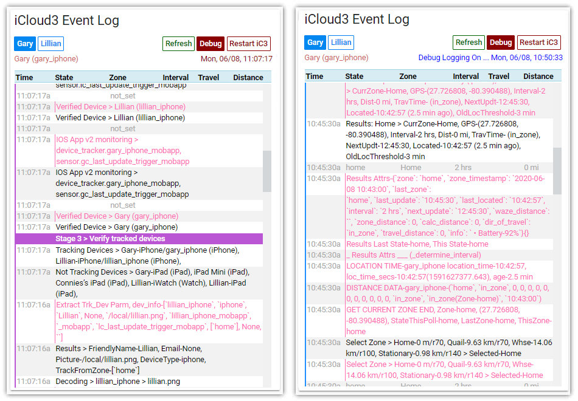

# Support Programs

### About the iCloud3 Event Log Custom Card

As iCloud3 runs, various entries are written to the HA log file that show device information, how it is tracked, operational errors, startup information and other items that may help determine what is going on if there is a problem and to monitor when the device's information is determined and updated. A lot of this information is also written to the `iCloud3 Event Log` which can be viewed using the `iCloud3 Event Log Lovelace Card`. 


###### Event Log during iCloud Initialization


###### Event Log locating devices


### Installing the iCloud3 Event Log Custom Card

Custom Lovelace cards are typically stored in the `/www/custom_cards` directory. Do the following:

1. Create the `/www/custom_cards` directory if it does not exist. 

2. Copy the `icloud3-event-log-card.js` into the `/www/custom-cards` directory. If you are already using custom cards and they are in a different directory,  copy the `icloud3-event-log-card.js` file into the one you are using.

3. Open the configuration.yaml` file and add the following lines to the beginning of the file. Again, change the directory name if you are using a different location.

   ```
   lovelace:
     mode: yaml (if you are not using the lovelace configurator)
     resources:
       - url: /local/custom_cards/icloud3-event-log-card.js
         type: module
   ```

4. Add the following lines to the `ui-lovelace.yaml` file to create the custom card. 

   ```
    - title: iCloud Event Log
      icon: mdi:information-outline 
      cards: 
        - type: custom:icloud3-event-log-card
          entity: sensor.icloud3_event_log
   ```

More information is found in the Home Assistant Lovelace documentation regarding setting up and using custom cards. Be sure to refer to it if you have any problems. Go [here](https://community.home-assistant.io/t/how-do-i-add-custom-cards-with-the-lovelace-ui/97902) for more information if you are not using the `ui-lovelace.yaml` file to set up your cards.

### Solving iCloud3 Problems with the Event Log

###### Identifying iCloud3 Startup Errors

During iCloud3 initialization, it goes through 5 stages to get everything prepared to locate devices. These include:
* Stage 1 - Preparing iCloud3 - Read the configuration files, validate the Waze Route tracking service, load the zone data and set up the Stationary Zone
* Stage 2 - Verify iCloud Location Services - Determine the tracking method and authorize the iCloud account
* Stage 3 - Set up Tracked Devices - Decode the track_device configuration parameter, determine the iOS App version, analyze the entity registry file and match the the v2 entities with the device.
* Stage 4 - Set up the devices to be tracked - Set the device's Stationary Zone, set up the device's sensors and initialize device related variables to prepare for tracking.

Things can go wrong during any of these steps from logging into Apple iCloud , invalid device identification data, not being able to find the device in the iCloud account, location GPS errors, etc. The Event Log can help identify and solve these issues. Below are sample screens showing authentication errors and device errors.


###### Using the Debug Button  

As iCloud3 runs, it can log debug information to the HA log file and to the Event Log. This can help identify a problem and may provide information leading to a solution. Click the `Debug` button to turn it on. Click it again to turn it off. The screen on the left shows an example of the information that is displayed.  

###### Using the Restart iC3 Button  

You can restart iCloud3 using the Restart-iC3 button.  This can be helpful if you first ran into an authorization error and want to restart iCloud3 and reinitialize all of the settings. Although the configuration parameters are not reloaded, new and changed zone information is.

