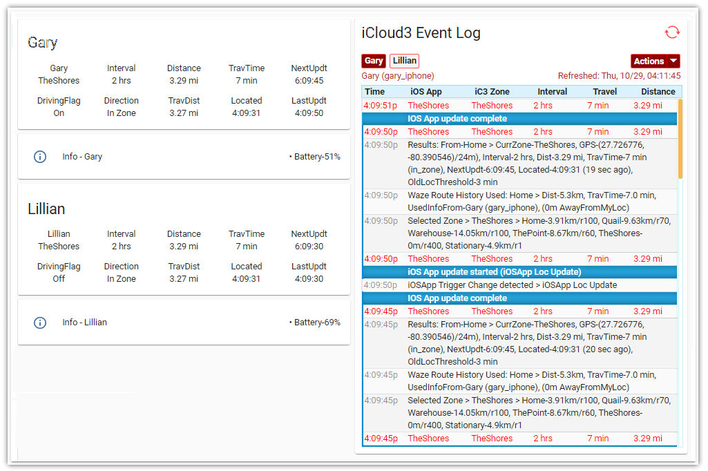
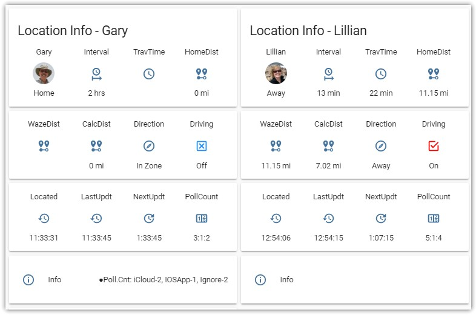

# Lovelace Cards

The following examples show how Lovelace Cards can show iCloud3 information in various formats.

### Example 1 - Two People and Event Log


```yaml
title: Home
views:
  - title: iCloud3
    path: icloud3
    panel: true
    badges: []
    cards:
      - type: horizontal-stack
        cards:
          - type: vertical-stack
            cards:
              - type: glance
                entities:
                  - entity: device_tracker.gary_iphone
                    name: Gary
                  - entity: sensor.gary_iphone_interval
                    name: Interval
                  - entity: sensor.gary_iphone_zone_distance
                    name: Distance
                  - entity: sensor.gary_iphone_travel_time
                    name: TravTime
                  - entity: sensor.gary_iphone_next_update
                    name: NextUpdt
                  - entity: input_boolean.gary_driving_flag
                    name: DrivingFlag
                    tap_action:
                      action: toggle
                  - entity: sensor.gary_iphone_dir_of_travel
                    name: Direction
                  - entity: sensor.gary_iphone_travel_distance
                    name: TravDist
                  - entity: sensor.gary_iphone_last_located
                    name: Located
                  - entity: sensor.gary_iphone_last_update
                    name: LastUpdt
                state_color: true
                show_icon: false
                title: Gary
              - type: entities
                entities:
                  - entity: sensor.gary_iphone_info
                    name: Info - Gary
                    icon: 'mdi:information-outline'
              - type: glance
                entities:
                  - entity: device_tracker.lillian_iphone
                    name: Lillian
                  - entity: sensor.lillian_iphone_interval
                    name: Interval
                  - entity: sensor.lillian_iphone_zone_distance
                    name: Distance
                  - entity: sensor.lillian_iphone_travel_time
                    name: TravTime
                  - entity: sensor.lillian_iphone_next_update
                    name: NextUpdt
                  - entity: input_boolean.lillian_driving_flag
                    name: DrivingFlag
                    tap_action:
                      action: toggle
                  - entity: sensor.lillian_iphone_dir_of_travel
                    name: Direction
                  - entity: sensor.lillian_iphone_travel_distance
                    name: TravDist
                  - entity: sensor.lillian_iphone_last_located
                    name: Located
                  - entity: sensor.lillian_iphone_last_update
                    name: LastUpdt
                show_icon: false
                state_color: true
                title: Lillian
              - type: entities
                entities:
                  - entity: sensor.lillian_iphone_info
                    name: Info - Lillian
                    icon: 'mdi:information-outline'

          - type: 'custom:icloud3-event-log-card'

```

*Note:* The above code can be pasted directly into the Lovelace card Raw Editor.


### Example 2 - Two People - 4x3 Format



```yaml
  - title: Location (Gary)
    icon: mdi:cellphone-iphone
    cards:
      - type: vertical-stack
        cards:
      - type: vertical-stack
        cards:
          - type: glance
            title: Location Info - Gary
            column_width: 25%
            entities:
              - entity: device_tracker.gary_iphone
                name: Gary
              - entity: sensor.gary_iphone_interval
                name: Interval
                icon: mdi:clock-start
              - entity: sensor.gary_iphone_travel_time
                name: TravTime
                icon: mdi:clock-outline
              - entity: sensor.gary_iphone_zone_distance
                name: HomeDist
                icon: mdi:map-marker-distance 
         
          - type: glance
            column_width: 25%
            entities:
              - entity: sensor.gary_iphone_waze_distance
                name: WazeDist
                icon: mdi:map-marker-distance
              - entity: sensor.gary_iphone_calc_distance
                name: CalcDist
                icon: mdi:map-marker-distance
              - entity: sensor.gary_iphone_dir_of_travel
                name: Direction
                icon: mdi:compass-outline
              - entity: input_boolean.gary_driving_flag
                name: Driving
                tap_action:  
                  action: toggle

          - type: glance
            column_width: 25%
            entities:
              - entity: sensor.gary_iphone_last_located
                name: Located
                icon: mdi:history
              - entity: sensor.gary_iphone_last_update
                name: LastUpdt
                icon: mdi:history
              - entity: sensor.gary_iphone_next_update
                name: NextUpdt
                icon: mdi:update
              - entity: sensor.gary_iphone_poll_count
                name: PollCount
                icon: mdi:counter
                tap_action: 
                  action: call-service
                  service: script.icloud3_command_event_log_gary
 
          - type: entities
            entities:
              - entity: sensor.gary_iphone_info
                name: Info
                icon: mdi:information-outline 
#-------------------------------------------------------------------------     
      - type: vertical-stack
        ccards:
          - type: glance
            title: Location Info - Lillian
            column_width: 25%
            entities:
              - entity: device_tracker.lillian_iphone
                name: Lillian
              - entity: sensor.lillian_iphone_interval
                name: Interval
                icon: mdi:clock-start
              - entity: sensor.lillian_iphone_travel_time
                name: TravTime
                icon: mdi:clock-outline
              - entity: sensor.lillian_iphone_zone_distance
                name: HomeDist
                icon: mdi:map-marker-distance 
         
          - type: glance
            column_width: 25%
            entities:
              - entity: sensor.lillian_iphone_waze_distance
                name: WazeDist
                icon: mdi:map-marker-distance
              - entity: sensor.lillian_iphone_calc_distance
                name: CalcDist
                icon: mdi:map-marker-distance
              - entity: sensor.lillian_iphone_dir_of_travel
                name: Direction
                icon: mdi:compass-outline
              - entity: input_boolean.lillian_driving_flag
                name: Driving
                tap_action:  
                  action: toggle

          - type: glance
            column_width: 25%
            entities:
              - entity: sensor.lillian_iphone_last_located
                name: Located
                icon: mdi:history
              - entity: sensor.lillian_iphone_last_update
                name: LastUpdt
                icon: mdi:history
              - entity: sensor.lillian_iphone_next_update
                name: NextUpdt
                icon: mdi:update
              - entity: sensor.lillian_iphone_poll_count
                name: PollCount
                icon: mdi:counter

          - type: entities
            entities:
              - entity: sensor.lillian_iphone_info
                name: Info
                icon: mdi:information-outline

```
### Example 3 - Two People - 5x2 Format


```yaml
  - title: Location (Gary)
    icon: mdi:cellphone-iphone
    cards:
      - type: vertical-stack
        cards:
          - type: glance
            title: Location Info - Gary
            column_width: 20%
            entities:
              - entity: device_tracker.gary_iphone
                name: Gary
              - entity: sensor.gary_iphone_interval
                name: Interval
                icon: mdi:clock-start
              - entity: sensor.gary_iphone_travel_time
                name: TravTime
                icon: mdi:clock-outline
              - entity: sensor.gary_iphone_zone_distance
                name: Home
                icon: mdi:map-marker-distance 
              - entity: sensor.gary_iphone_next_update
                name: NextUpdt
                icon: mdi:update
         
          - type: glance
            column_width: 20%
            entities:
              - entity: sensor.gary_iphone_waze_distance
                name: WazeDist
                icon: mdi:map-marker-distance
              - entity: sensor.gary_iphone_calc_distance
                name: CalcDist
                icon: mdi:map-marker-distance
              - entity: sensor.gary_iphone_dir_of_travel
                name: Direction
                icon: mdi:compass-outline
              - entity: sensor.gary_iphone_last_located
                name: Located
                icon: mdi:map-clock
              - entity: sensor.gary_iphone_last_update
                name: LastUpdt
                icon: mdi:history
              
          - type: horizontal-stack
            cards:
            - type: entities
              entities:
                - entity: sensor.gary_iphone_info
                  name: Info
                  icon: mdi:information-outline 

#-------------------------------------------------------------------------              
      - type: vertical-stack
        cards:
          - type: glance
            title: Location Info - Lillian
            column_width: 20%
            entities:
              - entity: device_tracker.lillian_iphone
                name: Gary
              - entity: sensor.lillian_iphone_interval
                name: Interval
                icon: mdi:clock-start
              - entity: sensor.lillian_iphone_travel_time
                name: TravTime
                icon: mdi:clock-outline
              - entity: sensor.lillian_iphone_zone_distance
                name: HomeDist
                icon: mdi:map-marker-distance 
              - entity: sensor.lillian_iphone_next_update
                name: NextUpdt
                icon: mdi:update
         
          - type: glance
            column_width: 20%
            entities:
              - entity: sensor.lillian_iphone_waze_distance
                name: WazeDist
                icon: mdi:map-marker-distance
              - entity: sensor.lillian_iphone_calc_distance
                name: CalcDist
                icon: mdi:map-marker-distance
              - entity: sensor.lillian_iphone_dir_of_travel
                name: Direction
                icon: mdi:compass-outline
              - entity: sensor.lillian_iphone_last_located
                name: Located
                icon: mdi:map-clock
              - entity: sensor.lillian_iphone_last_update
                name: LastUpdt
                icon: mdi:history
          - type: entities
            entities:
              - entity: sensor.lillian_iphone_info
                name: Info
                icon: mdi:information-outline 

```
### Example 3 - Tracking from two Zones - Home and Whse


```yaml
  - title: Location (Gary)
    icon: mdi:cellphone-iphone
    cards:
      - type: vertical-stack
        cards:
          - type: glance
            title: Location Info - Gary
            column_width: 20%
            entities:
              - entity: device_tracker.gary_iphone
                name: Gary
              - entity: sensor.gary_iphone_interval
                name: Interval
                icon: mdi:clock-start
              - entity: sensor.gary_iphone_travel_time
                name: TravTime
                icon: mdi:clock-outline
              - entity: sensor.gary_iphone_zone_distance
                name: Home
                icon: mdi:map-marker-distance 
              - entity: sensor.gary_iphone_next_update
                name: NextUpdt
                icon: mdi:update
         
          - type: glance
            column_width: 20%
            entities:
              - entity: sensor.gary_iphone_waze_distance
                name: WazeDist
                icon: mdi:map-marker-distance
              - entity: sensor.gary_iphone_calc_distance
                name: CalcDist
                icon: mdi:map-marker-distance
              - entity: sensor.gary_iphone_dir_of_travel
                name: Direction
                icon: mdi:compass-outline
              - entity: sensor.gary_iphone_last_located
                name: Located
                icon: mdi:map-clock
              - entity: sensor.gary_iphone_last_update
                name: LastUpdt
                icon: mdi:history
              
          - type: horizontal-stack
            cards:
            - type: entities
              entities:
                - entity: sensor.gary_iphone_info
                  name: Info
                  icon: mdi:information-outline 

#-------------------------------------------------------------------------              
      - type: vertical-stack
        cards:
          - type: glance
            title: Location Info - Gary (Warehouse)
            column_width: 25%
            entities:
              - entity: device_tracker.gary_iphone
                name: Gary
              - entity: sensor.whse_gary_iphone_interval
                name: Interval
                icon: mdi:clock-start
              - entity: sensor.whse_gary_iphone_travel_time
                name: TravTime
                icon: mdi:clock-outline
              - entity: sensor.whse_gary_iphone_zone_distance
                name: Whse
                icon: mdi:map-marker-distance 
              - entity: sensor.whse_gary_iphone_next_update
                name: NextUpdt
                icon: mdi:update
         
          - type: glance
            column_width: 25%
            entities:
              - entity: sensor.whse_gary_iphone_waze_distance
                name: WazeDist
                icon: mdi:map-marker-distance
              - entity: sensor.whse_gary_iphone_calc_distance
                name: CalcDist
                icon: mdi:map-marker-distance
              - entity: sensor.whse_gary_iphone_dir_of_travel
                name: Direction
                icon: mdi:compass-outline
              - entity: sensor.whse_gary_iphone_last_located
                name: Located
                icon: mdi:map-clock
              - entity: sensor.whse_gary_iphone_last_update
                name: LastUpdt
                icon: mdi:history
 
          - type: entities
            entities:
              - entity: sensor.whse_gary_iphone_info
                name: Info
                icon: mdi:information-outline 
```

