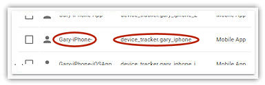
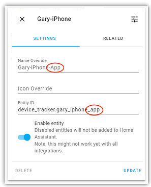
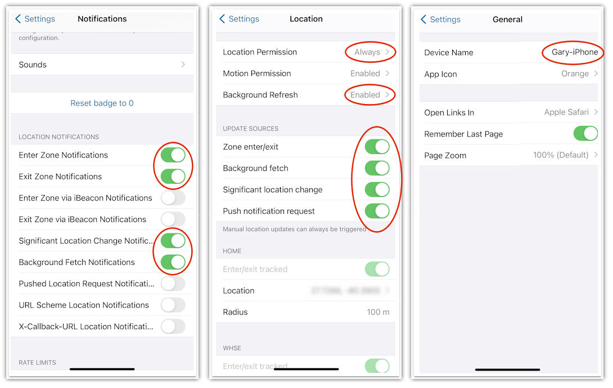
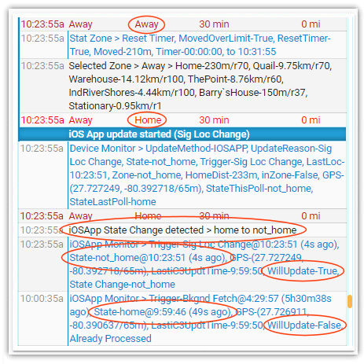
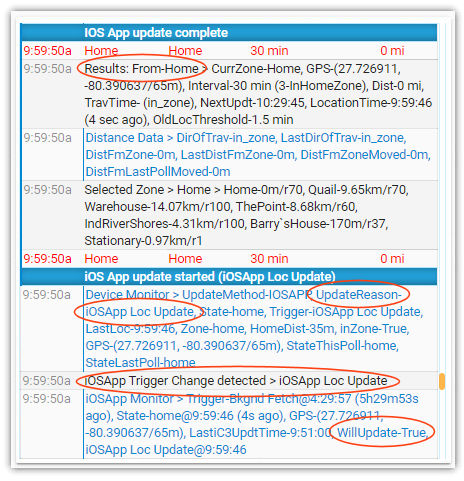

# Setting up the iOS App

### Install and prepare the iOS App

The iOS App needs to be installed on every phone you are tracking and the mobile_device integration needs to be set up in Home Assistant. Extensive documentation on the iOS App can be found [here](https://companion.home-assistant.io/).

1. Download and install the iOS App from the Apple iCloud store.
2. Add the mobile_app integration using the *HA Sidebar > Configuration > Integrations* screen. The process is described in the HA documentation.

### The iOS App must be able to connect to your local HA server

The iOS App installed on the phone must be able to communicate with your HA server and display the same lovelace dashboard screens you normally see when you are home. If the iOS App does not have access to your local HA server, it will not issue zone change or location change triggers. iCloud3 will not recognize any location changes and will act as if the iOS App is not installed. I use DuckDNS and HA 2-factory authentication to provide an encrypted and secure remote environment.

### Setting the *device_tracker entity* name created by the iOS App

The Chapter 1.2 Getting Started chapter explained how iCloud3 monitors your iCloud account and the iOS App entities using the device_tracker.[devicename] entity. it also describes how the phone's name (*General > About > Name*) must be the same as the iCloud3 devicename parameter and the iOS App device_tracker entity name must start with the same value and be followed by a suffix to make it unique. The following describes setting this up in more detail.

*Note:* These instructions are based on HA 0.114 and subject to change. 

A suffix must be added onto the device_tracker Entity ID so it is not the same as the iCloud and iCloud3 name. It can be a number (*_2, _3*, etc.) or text (*_app, _iosapp*, etc.). Do the following:

1. On your main Home Assistant screen, select `HA Sidebar > Configuration > Entities`. This will display a list of your Entities. Select the **Entities** heading to sort by Entity ID.

2. Scroll to the *Mobile App* section for the device_tracker entity of the phone you are setting up.

3. Select it (e.g., *Gary-iPhone*) to open the Update window.

4. Change the **Name Override** field to add the suffix (i.e., *Gary-iPhone*  to  *Gary-iPhone-2 or *Gary-iPhone-App*, etc.). This will let you identify the iOS App entity in the HA History logs.
5. Change the **Entity ID** field to add the suffix (i.e., *device_tracker.gary_iphone*  to  *device_tracker.gary_iphone_app* or *device_tracker.gary_iphone_iosapp*, etc.)
6. Select **Update**.
7. Restart Home Assistant to load the new device_tracker entity name.  

#### iOS App Settings

Every phone you are tracking with iCloud3 must have the iOS App installed on it, whether you are using the iOS App or not.

!> If you do not install the iOS App on the phone being tracked, an error message is displayed in the Event Log that the iOS App device_tracker entity can not be found.

The following are iOS App screenshots showing how the app should be configured.

- **Notification screen** - A notification is displayed on the phone when these events occur. They should be set to *On* during the installation iCloud3 phase and can be turned off once you have verified everything is working correctly.
- **Location screen** - The highlighted fields control how triggers are sent to HA and iCloud3 from the iOS App and must be the values indicated. If Location Permission is *Never* and the other items are *Off*, triggers will not be sent and the iOS App will be Inactive.
- **General screen** - Various messages and location requests are sent to the Device Name. This name is automatically detected when iCloud3 starts.

#### iOS App Triggers and the Event Log iOS App Monitor

As mentioned in *Chapter 1.2 - Getting Started*, the iOS App issues zone enter and exit triggers, significant location triggers, manual refresh triggers, etc. that are monitored by iCloud3. iCloud3 reacts to these triggers and updates the phone's location when it detects a change. 

iCloud3 adds records to the Event Log when it detects a change in the trigger's *state* value or *last_update_time*, determines if the location and/or trigger is older or newer than  those previously processed and determines if the phone should be updated. These entries are normally hidden, they are typically used to troubleshoot problems when expected update events are not occurring. To display them, select *Event Log > Actions > Show/Hide iOS App Monitors*. Below are examples of the iOS App Monitor screens.

