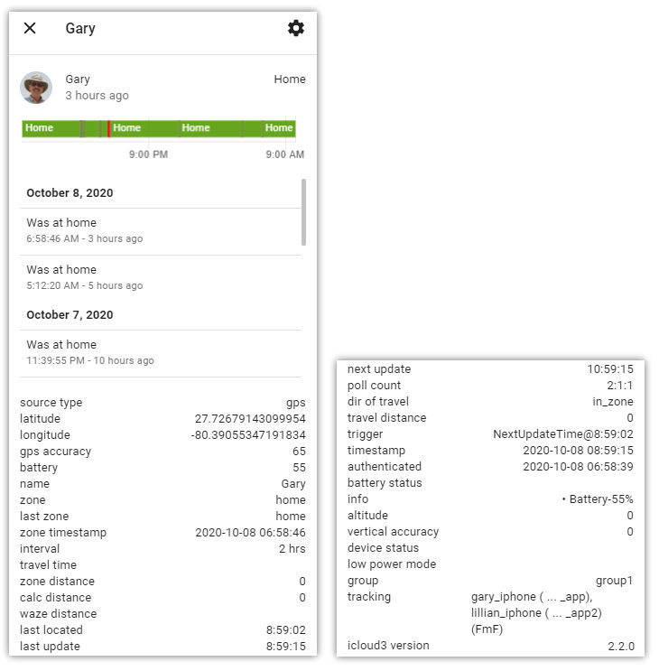

# iCloud3 Attributes

Many attributes are updated when the device is polled for it's location, distance and the travel time from Home or another zone. They can be used in automations and scripts and displayed on Lovelace Cards.  Sensors are created also for many of the attributes and are discussed in further detail in the Sensors chapter.

### Location and Polling Attributes

The following attributes are all based on the zone's location. The information for the Home zone is always calculated. They are also calculated when another zone is found on the *devices/device_name* parameter for a device. You can have more than one zone on the configuration parameter for a device. See *Chapter 2.1 - Configuration Parmeters* for more information.

!> The device_tracker.devicename_attributes always show the information as it relates to the Home zone. Additional sensors are created for the distance and time information that is calculated for the other zones.

### Device Status Information Attributes

###### source_type 

How the the HA IOS App located the device. This includes gps, beacon, router.   

###### latitude, longitude, altitude 

The location of the device based on information received from the iCloud location services or the IOS App.  

###### gps_accuracy 

The horizontal location accuracy (in meters) reported by iCloud and the iOS App.  

###### battery

The battery level of the device reported by iCloud (Family Sharing tracking method) or the iOS App (Find-my-Friends or iOS App tracking method). 

###### battery_status 

Charging or NotCharging. This returned from iCloud and is not always available.

###### device_status 

The status of the device — online if the device is located or offline if polling has been paused or it can not be located.  This returned from iCloud and is not always available.

###### low_power_mode 

If the device is running in low power mode.

###### vertical_accuracy 

Device information provided by the iCloud account.  This information is not verified by iCloud3 and passed along as reported by the IOS app.

### Device Tracking Attributes

###### zone, last_zone 

The device's current and last zone. This is not to be confused with the device's state. The state can be changed by other programs (IOS app or automations issuing device_tracker.see service calls) where the zone attribute is only updated by iCloud3. Using the Zone attribute to trigger an automation eliminates the gps wandering problems (or greatly reduces them). 

###### zone_timestamp 

When the device's zone attribute was last changed.

###### interval 

The current interval between location update requests sent to your iCloud account. 

###### travel_time 
The Waze travel time to arrive at the `base zone` from your current location.  

###### zone_distance 
The distance from the `base zone` (i.e., home, office). This will be either the Waze distance or the calculated distance.  

###### calc_distance 

The 'straight line' distance that is calculated using the latitude and longitude of the `base zone` and your current location using geometric formulas.  

###### waze_distance 

The driving distance from the `base zone` returned by Waze based on the shortest route.  

###### last_located 

The last time your iCloud account successfully located the device. Normally, this will be a few seconds after the update time, however, if you are in a dead zone or the GPS accuracy exceeds the threshold, the time will be older. In this case, a description of the issues is displayed in the `info` attribute field.  

###### last_update 

The time of the last iCloud location update.  

###### next_update 

The time of the next iCloud location update.  

###### poll_count 

The number of iCloud, IOS App and discarded transaction counts for the day. It's format is '##:##:##'. For example, a value of '10 : 14 : 21' indicates the iCloud account was polled 10 times, the IOS App sent 14 triggers and  21 transactions were discarded because they were more than 2-minutes old or had a  GPS accuracy that was more than the `gps_accuracy_threshold` configuration parameter.

###### dir_of_travel 
The direction you are traveling — towards, away, near, or stationary. This is determined by calculating the difference between the distance from the `base zone` on this location update and the last one. Stationary can be a little difficult to determine at times and sometimes needs several updates to get right.  

###### travel_distance 

The distance traveled since the last location update.

###### info 
A message area displaying information about the device. This includes the errors, battery level, Waze status, GPS accuracy issues, how long the device has been stationary, etc.  

### iCloud3 Operational Attributes

###### trigger 
The action or notification that caused the last update (Geographic Zone Entered or Exited, Background Fetch, Manual, iCloud, Next Update Time Reached, Enter Stationary Zone, etc.).

###### timestamp 
When the last update was completed.

###### authenticated 

When the device's iCloud account was last authenticated.  

###### tracking 

The devices that are being tracked based on the *devices/device_name* configuration parameter that were successfully verified when iCloud3 started. The format is *devicename (monitored iosapp_devicename)* e.g., *gary_iphone (gary_iphone_iosapp)*

###### icloud3_version 

The version of iCloud3 you are running.  

