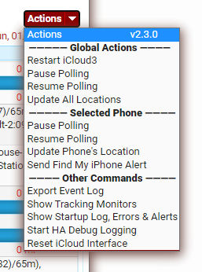

## The iCloud3 Event Log Card

This chapter explains:

- About the iCloud3 Event Log 
- What can be done using the Actions Command pulldown menu

### About the Event Log

As iCloud3 runs, various entries are written to the HA log file that show device information, how it is tracked, operational errors, startup information and other items that may help determine what is going on if there is a problem and to monitor when the device's information is determined and updated. A lot of this information is also written to the `iCloud3 Event Log` which can be viewed using the `iCloud3 Event Log Lovelace Card`. 

##### iCloud3 Event Log During Initialization

A lot happens when iCloud3 is initialized. The various activities are divided into stages, which include:

- Stage 1 - Read the configuration files, validate the Waze Route tracking service, load the zone data and set up the Stationary Zone.

- Stage 2 - Decode the *devices* configuration parameter, extract the devices to be tracked and their associated parameters.

- Stage 2a - Set up Tracked Devices for the iCloud tracking method. Show the devices that have been returned from iCloud Location Services that can be located and tracked.

- Stage 2b - Set up Tracked Devices - Decode the track_device configuration parameter, determine the iOS App version, analyze the entity registry file and match the the v2 entities with the device.

- Stage 3 - Scan the HA Entity Registry and match the devices being tracked with their iOS App device tracker entities.

- Stage 4 - Finish configuring the tracked devices

##### Event Log locating devices

 

Typically Lovelace custom cards are stored in their own directory that is within the `config/www/` directory. iCloud3 and the instructions below, use the `www/custom_cards` directory although you may be storing them in another location (e.g.,`www/community`). 

!>If you are not using the `www/custom_cards` directory, use your directory name (e.g., `www/community`) instead of `www/custom_cards` in the following instructions. Then specify your directory name using the *event_log_card_directory: www/yourcustomcarddirectoryname* configuration parameter.

### Refreshing Events

The date/time the events were last refreshed is displayed under the *Actions* command at the top of the screen.  Usually the events are refreshed when you display the screen but there are times when you will need to refresh them manually. This may be when:

- The Event Log is displayed and the events for last Person did not automatically refresh. 

- iCloud3 clears the *sensor.icloud3_event_log* that passes events from iCloud3 to the Event Log lovelace card every 15-minutes or so. Only the last 20 events, at the time the sensor is cleared, are displayed. A message informs you that the list needs to be refreshed.

Click the Refresh button in the upper right corner.

### Displaying the *iCloud3 User Manual*

You are reading the  *iCloud3 User Manual* now. 

Click the  Help button in the upper right corner.

### The Actions Command

The Actions Command lets you interact with iCloud3 while it is running. 

###### Global Actions - Actions performed on all tracked devices

- **Restart iCloud3** - Restart iCloud3 and reload the config_ic3.yaml file configuration file with any changes you have made.
- **Pause Polling** - Pause polling on all phones
- **Resume Polling** - Resume polling
- **Update All Locations** - Request the location from the iOS App for all phones being tracked.

###### Device Actions - Actions performed on the selected device

- **Pause Polling** - Pause polling on the selected phone
- **Resume Polling** - Resume polling on the selected phone
- **Update Phone's Location**  - Request the selected phone's location from the iOS App
- **Send Find My iPhone Alert** - Sends an alert message to the selected phone. The Apple Find my iPhone alert is sent if the Family Sharing tracking method is used for the phone. If another tracking method is used, the alert is sent to the iOS App.

###### Other Commands

- **Export Event Log** - Export the Event Log data to the *config/icloud3-event-log.log* file. (see below)
- **Show/Hide Tracking Monitors** - Show/Hide location tracking, state and trigger data from the iOS App. It also shows the results of the last update for the phone. (see below)
- **Show Startup Log, Errors, Alerts** - Only show these items from the Event Log, do not show any tracking entries. This easily lets you view errors and alerts that may have happened hours ago. (see below)
- **Start HA Debugging** - Start/Stop additional debugging logs. (see below)
- **Reset iCloud Interface** - The iCloud Authentication cookie and session files used by the iCloud Location Services (pyicloud_ic3.py) program are deleted. Apple will request the 6-digit Verification Code within 30-seconds. See *Chapter 2.1 - Getting Started/Authentication your iCloud Account* for more information.

#### Show/Hide Tracking Monitors

As iCloud3 runs, the state, trigger and location information is added to the Event Log when it changes.  The *iOS App Monitor* shows information from the iOS App device_tracker entities being monitored and the *Device Monitor* shows the results of the last location update.

#### Show Startup Log, Errors, Alerts

iCloud3 may encounter an error while starting up, while tracking a device, while communicating with the iOS App, with the iCloud Location Service, etc. An error message is added to the Event Log for important errors and Alert messages are added to notify you of a problem iCloud3 has encountered and will retry. This Action only shows events related to starting up, to errors and to alerts. No phone tracking events are shown. 

Select the Person/phone to redisplay tracking events again.

#### Export Event Log

The Event Log can be exported to the */config/icloud3-event-log.log* file. It is a tab delimited text file that shows the start up events first, followed by each of the tracked devices. It can be opened by a text editor such as Notepad++ or imported into a spreadsheet file.

