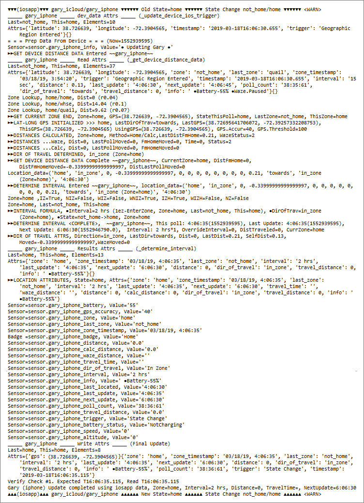

# Technical Information

### How the Interval is Determined

The iCloud3 device tracked uses data from several sources to determine the time interval between the iCloud Find my Friends location update requests.  The purpose is to provide accurate location data without exceeding Apple's limit on the number of requests in a time period and to limit the drain on the device's battery.

The algorithm uses a sequence of tests to determine the interval. If the test is true, it's interval value is used and no further tests are done. The following is for the nerd who wants to know how this is done. 


| Test | Interval | Method Name|
|------|----------|------------|
| --- `The Zone (State) changed` --- |  | |
| Zone changed to Stationary Zone | stationary_inzone_interval | 1sz-Stationary |
| Zone Changed to other zone | inzone_interval | 1ez-Zone |
| In near_zone close to home (or another zone) | 15 seconds | 1nz-InHomeNearZone |
| In near_zone far from Home (or another zone) | 15 seconds | 1nhz-InOtherNearZone |
| Left Home zone (or another zone) | 4 minutes | 1ehz-ExitHomeZone |
| Left other zone (or another zone) | 2 minutes | 1ez-ExitOtherZone |
| Entered Another Zone | 4 minutes | 1cz-ZoneChanged |
| --- `The Zone (State) did not change` -- |  |  |
| Poor GPS Accuracy | 1 minute | 2-PoorGPS |
| Override interval specified | inzone_interval | 3-Override |
| In Stationary zone | stationary_inzone_interval | 4sz-Stationary |
| In Home zone or near Home zone and direction is Towards (or another zone) | inzone_interval | 4iz-InZone |
| In near_zone | 15 seconds | 4nz-NearZone |
| In other zone & inzone_interval > waze time | inzone_interval | 4iz-InZone |
| Just left a zone | 2.5 minutes | 5-LeftZone |
| Distance from zone < 2.5km/1.5mi | 15 seconds | 10a-Dist < 2.5km |
| Distance from zone < 3.5km/2mi | 30 seconds | 10b-Dist < 3.5km |
| Waze used and Waze time < 5 min. | time `travel_time_factor` | 10c-WazeTime |
| Distance from zone < 5km/3mi | 1 minute | 10d-Dist < 5km |
| Distance from zone < 8km/5mi | 3 minutes | 10e-Dist < 8km |
| Distance from zone < 12km/7.5mi | 15 minutes | 10f-Dist < 12km |
| Distance from zone < 20km/12mi | 10 minutes | 10g-Dist < 20km |
| Distance from zone < 40km/25mi | 15 minutes | 10h-Dist < 40km |
| Distance from zone < 150km/90mi | 1 hour | 10i-Dist < 150km |
| Distance from zone > 150km/90mi | distance/1.5 | 20-Calculated |

`Notes:` The interval is then multiplied by a value based on other conditions. The conditions are:
1. If Stationary, keep track of the number of polls when you are stationary (the stationary count reported in the `info` attribute). Multiply the interval time by 2 when the stationary count is an even number and by 3 when it is divisible by 3.
1. If the direction of travel is Away, multiply the interval time by 2.
1. Is the battery is low, the GPS accuracy is poor or the location data is old, don't make any of the above adjustments to the interval.

   
### Displaying Interval Calculation Information in the `Info` Field

iCloud3 can display information on how the `Interval` time was calculated when the device is polled. As mentioned, this is dependent on the zone, direction of travel, Waze travel time (if Waze is used), the distance between your current location and home and the accuracy of the gps information provided by the iCloud service and the IOS App. Below are samples what is displayed in the `Info` field.

 In this case, the device is not_home (actually, not in a zone) and just left the Stationary Zone.

```reStructuredText
●Interval=3 min (0-iosAppTrigger, Zone=not_home, Last=stationary, This=not_home), ●DirOfTrav=away_from (Dist=1.88), ●State=stationary->not_home, Zone=not_home ●Battery-85%
```

In this case, Gary just arrived home and is now in the Home Zone.

```reStructuredText
●Interval=2 hrs (1ez-EnterZone, Zone=home, Last=not_home, This=home), ●DirOfTrav=in_zone (Zone=home), ●State=not_home->home, Zone=home ●Battery-84%'
```

The following script will toggle writing the debug information:

```yaml
icloud_command_info_interval_formula:
  alias: 'Display Interval Formula'
  sequence:
    - service: device_tracker.icloud_update
      data:
        account_name: gary_icloud
        command: info interval
```


### Writing Debug Information to the HA Log File

iCloud3 can toggle writing debug information to the HA Log file on and off. Below is a sample of the information that is written. In this case, Gary was arriving home and updating `gary_iphone` data was triggered by a Zone/State Change (not_home to home) in the automation `au_home_away_gary.yaml`

You have to have the `Logger: info` entry in the `configuration.yaml` file but you do not have to have any other 'debug' parameters.

This entry was triggered by a Zone/State change from 'not_home' to 'home'.




The following script will toggle writing the debug information:

```yaml
icloud_command_info_logging_toggle:
  alias: 'Write Details to Log File (Toggle)'
  sequence:
    - service: device_tracker.icloud_update
      data:
        account_name: gary_icloud
        command: info logging
```
